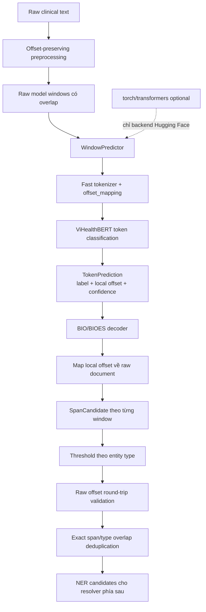
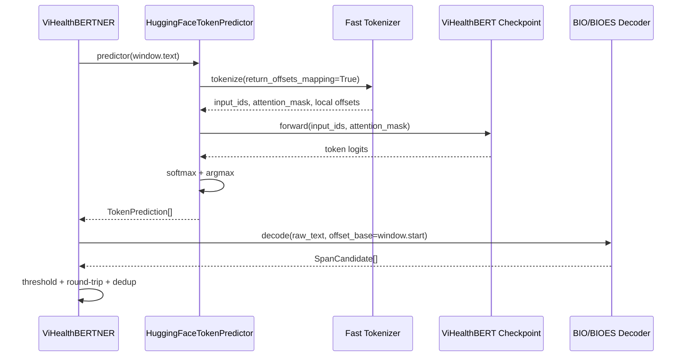

# ViHealthBERT NER — Implementation, workflow và trace

Tài liệu này là tài liệu hợp nhất cho **ViHealthBERT NER layer** đã triển khai trong `src/vihealthbert_ner.py`. Module nhận raw-text windows, chạy token-classification, decode BIO/BIOES và trả về `SpanCandidate`. Module **không** thực hiện assertion, ontology linking hoặc quyết định entity canonical cuối.

## 1. Trạng thái triển khai

Các thành phần đã có:

- `TokenPrediction`: nhãn token, confidence và character offset cục bộ trong model window.
- `WindowPredictor`: interface tách backend inference khỏi decoder.
- `decode_token_predictions(...)`: decode BIO/BIOES thành `SpanCandidate` dùng raw-document offset `[start, end)`.
- `ViHealthBERTNER`: chạy predictor trên `model_windows`, map local offset về raw document, áp threshold theo type và deduplicate candidate ở vùng overlap.
- `HuggingFaceTokenPredictor`: backend tùy chọn dùng fast tokenizer và `AutoModelForTokenClassification`.
- Lazy import `torch` và `transformers`, do đó phần rule-based và unit test decoder không phụ thuộc các package model.

Quy tắc offset cốt lõi:

- Input model là nguyên văn `TextWindow.text`, không phải normalized lookup text.
- Offset tokenizer là offset cục bộ trong window.
- Raw offset được tính bằng `window.start + token_offset`.
- Candidate chỉ được giữ nếu `raw_text[start:end] == candidate.text`.
- Mọi span dùng quy ước half-open `[start, end)`.

---

## 2. Workflow tổng quát



### Input và output của layer

```text
Input:
  raw_text
  file_id
  model_windows: TextWindow[]
  predictor: WindowPredictor
  thresholds theo entity type

Output:
  SpanCandidate[]
```

Output vẫn là **candidate**, không phải entity cuối:

```python
SpanCandidate(
    file_id="42",
    text="đau ngực dữ dội",
    start=38,
    end=53,
    type_candidate="TRIỆU_CHỨNG",
    source=["vihealthbert_ner"],
    confidence=0.92,
    notes="model_window=1",
)
```

---

## 3. Trách nhiệm của từng thành phần

## 3.1 Offset-preserving preprocessing

### Trách nhiệm

- Giữ `raw_text` bất biến.
- Chia văn bản dài thành `model_windows`.
- Mỗi window lưu offset tuyệt đối về raw document.
- Có overlap để giảm nguy cơ cắt entity ở biên window.

### Ví dụ

Raw document:

```text
Tiền sử tăng huyết áp. Hiện bệnh nhân đau ngực dữ dội và dùng aspirin.
```

Độ dài raw text là `70` ký tự. Một cấu hình minh họa tạo hai window:

```text
Window 0:
  raw span = [0, 54)
  text     = "Tiền sử tăng huyết áp. Hiện bệnh nhân đau ngực dữ dội "

Window 1:
  raw span = [23, 70)
  text     = "Hiện bệnh nhân đau ngực dữ dội và dùng aspirin."
```

Vùng `[23, 54)` xuất hiện trong cả hai window. Cụm `đau ngực dữ dội` vì vậy có thể được model dự đoán hai lần.

### Bất biến cần giữ

```python
raw_text[window.start:window.end] == window.text
```

---

## 3.2 `WindowPredictor`

### Trách nhiệm

`WindowPredictor` là interface tối giản:

```python
def __call__(text: str) -> Sequence[TokenPrediction]:
    ...
```

Nó chỉ biết text của **một window**, không cần biết raw-document offset. Điều này tách:

- Logic model/tokenizer.
- Logic decode và raw offset.
- Unit test không cần tải checkpoint thật.

### Ví dụ predictor giả lập

```python
def predictor(text):
    start = text.find("đau ngực dữ dội")
    if start < 0:
        return []
    return [
        TokenPrediction("B-TRIỆU_CHỨNG", start, start + 3, 0.91),
        TokenPrediction("I-TRIỆU_CHỨNG", start + 4, start + 8, 0.92),
        TokenPrediction("I-TRIỆU_CHỨNG", start + 9, start + 11, 0.90),
        TokenPrediction("E-TRIỆU_CHỨNG", start + 12, start + 15, 0.95),
    ]
```

Predictor giả lập phù hợp để kiểm thử decoder. Production backend có thể là `HuggingFaceTokenPredictor`.

---

## 3.3 Fast tokenizer và `offset_mapping`

### Trách nhiệm

Backend Hugging Face gọi tokenizer với:

```python
encoded = tokenizer(
    window_text,
    return_offsets_mapping=True,
    return_tensors="pt",
    truncation=True,
    max_length=512,
)
```

Mỗi token/subword nhận span cục bộ `[start, end)` trong `window_text`.

### Ví dụ trên Window 1

Window 1 bắt đầu tại raw offset `23`:

```text
Window 1 text:
"Hiện bệnh nhân đau ngực dữ dội và dùng aspirin."
```

Các token quan trọng có local offset minh họa:

| Token | Local offset | Raw offset | Raw slice |
|---|---:|---:|---|
| `đau` | `[15, 18)` | `[38, 41)` | `đau` |
| `ngực` | `[19, 23)` | `[42, 46)` | `ngực` |
| `dữ` | `[24, 26)` | `[47, 49)` | `dữ` |
| `dội` | `[27, 30)` | `[50, 53)` | `dội` |
| `aspirin` | `[39, 46)` | `[62, 69)` | `aspirin` |

Công thức map:

```text
raw_start = window.start + local_start
raw_end   = window.start + local_end
```

Ví dụ token `đau`:

```text
raw_start = 23 + 15 = 38
raw_end   = 23 + 18 = 41
raw_text[38:41] == "đau"
```

Special tokens như `<s>`, `</s>`, `[CLS]`, `[SEP]` thường có offset `(0, 0)` và bị bỏ qua.

---

## 3.4 ViHealthBERT token classification

### Trách nhiệm

Model sinh logits cho từng token. Backend chuyển logits thành probability:

```text
logits
  → softmax
  → argmax label
  + max probability
```

### Ví dụ BIOES

| Token | Label dự đoán | Confidence |
|---|---|---:|
| `Hiện` | `O` | 0.99 |
| `bệnh` | `O` | 0.98 |
| `nhân` | `O` | 0.99 |
| `đau` | `B-TRIỆU_CHỨNG` | 0.91 |
| `ngực` | `I-TRIỆU_CHỨNG` | 0.92 |
| `dữ` | `I-TRIỆU_CHỨNG` | 0.90 |
| `dội` | `E-TRIỆU_CHỨNG` | 0.95 |
| `và` | `O` | 0.98 |
| `dùng` | `O` | 0.97 |
| `aspirin` | `S-THUỐC` | 0.81 |

`id2label` trong checkpoint phải ánh xạ đúng tới các label trên. Nếu checkpoint trả type ngoài năm type của schema, decoder coi label đó là `O`.

---

## 3.5 `TokenPrediction`

### Trách nhiệm

Mỗi token không phải special token được chuyển thành:

```python
TokenPrediction(
    label="B-TRIỆU_CHỨNG",
    start=15,
    end=18,
    confidence=0.91,
)
```

Lưu ý `start/end` ở đây là **local offset của window**, chưa phải offset raw document.

Validation cơ bản:

- `start >= 0`.
- `end >= start`.
- `0 <= confidence <= 1`.
- Trước khi decode, token phải không vượt quá `len(window.text)`.

Ví dụ lỗi bị reject:

```text
window length = 10
TokenPrediction(start=8, end=12, ...)
                              ^^ vượt window
```

---

## 3.6 BIO/BIOES decoder

### Quy tắc chuẩn

| Prefix | Ý nghĩa |
|---|---|
| `B` | Bắt đầu entity nhiều token |
| `I` | Token bên trong entity |
| `E` | Kết thúc entity |
| `S` | Entity một token |
| `O` | Ngoài entity; đóng entity đang mở |

BIO không có `E/S`; entity được đóng khi gặp `O`, `B` mới, type mới hoặc hết sequence.

### Trace decode triệu chứng

Input:

```text
B-TRIỆU_CHỨNG  đau   [15,18)  0.91
I-TRIỆU_CHỨNG  ngực  [19,23)  0.92
I-TRIỆU_CHỨNG  dữ    [24,26)  0.90
E-TRIỆU_CHỨNG  dội   [27,30)  0.95
```

Trace trạng thái:

| Bước | Label | Active type | Active local span | Hành động |
|---:|---|---|---:|---|
| 1 | `B-TRIỆU_CHỨNG` | `TRIỆU_CHỨNG` | `[15,18)` | Mở entity |
| 2 | `I-TRIỆU_CHỨNG` | `TRIỆU_CHỨNG` | `[15,23)` | Mở rộng end |
| 3 | `I-TRIỆU_CHỨNG` | `TRIỆU_CHỨNG` | `[15,26)` | Mở rộng end |
| 4 | `E-TRIỆU_CHỨNG` | `TRIỆU_CHỨNG` | `[15,30)` | Mở rộng rồi đóng |

Raw span:

```text
start = 23 + 15 = 38
end   = 23 + 30 = 53
text  = raw_text[38:53] = "đau ngực dữ dội"
```

Span confidence baseline:

```text
(0.91 + 0.92 + 0.90 + 0.95) / 4 = 0.92
```

### Malformed transition recovery

Input lỗi:

```text
I-TRIỆU_CHỨNG  ho
B-CHẨN_ĐOÁN    viêm
I-CHẨN_ĐOÁN    phổi
```

Decoder sửa bảo thủ:

1. `I-TRIỆU_CHỨNG` không có entity mở → coi như bắt đầu entity `ho`.
2. Gặp `B-CHẨN_ĐOÁN` → đóng `ho`, mở entity chẩn đoán.
3. `I-CHẨN_ĐOÁN` → nối thành `viêm phổi`.
4. Hết sequence → đóng entity.

Output:

```text
"ho"         → TRIỆU_CHỨNG
"viêm phổi"  → CHẨN_ĐOÁN
```

---

## 3.7 Tạo `SpanCandidate`

Mỗi entity đã decode được chuyển sang schema chung của pipeline.

### Ví dụ chẩn đoán ở Window 0

Model dự đoán:

```text
B-CHẨN_ĐOÁN  tăng    local [8,12)
I-CHẨN_ĐOÁN  huyết   local [13,18)
E-CHẨN_ĐOÁN  áp      local [19,21)
```

Window 0 bắt đầu tại `0`, nên raw span cũng là `[8,21)`:

```python
SpanCandidate(
    file_id="42",
    text="tăng huyết áp",
    start=8,
    end=21,
    type_candidate="CHẨN_ĐOÁN",
    source=["vihealthbert_ner"],
    confidence=0.88,
    notes="model_window=0",
)
```

Các trường assertion và ontology mapping chưa được điền trong layer này.

---

## 3.8 Threshold theo entity type

### Vì sao không dùng một threshold chung?

Các type có precision/recall và vai trò khác nhau:

- `TRIỆU_CHỨNG`, `CHẨN_ĐOÁN`: NER là semantic extractor chính.
- `THUỐC`, xét nghiệm: parser cấu trúc sẽ xác nhận hoặc tạo boundary cuối.
- Candidate thừa có thể làm giảm score cuối.

### Cấu hình minh họa

```python
thresholds = {
    "TRIỆU_CHỨNG": 0.80,
    "CHẨN_ĐOÁN": 0.65,
    "THUỐC": 0.85,
    "TÊN_XÉT_NGHIỆM": 0.80,
    "KẾT_QUẢ_XÉT_NGHIỆM": 0.85,
}
```

Áp dụng lên trace:

| Candidate | Confidence | Threshold | Kết quả |
|---|---:|---:|---|
| `tăng huyết áp` / `CHẨN_ĐOÁN` | 0.88 | 0.65 | Giữ |
| `đau ngực dữ dội` / `TRIỆU_CHỨNG` | 0.86 từ Window 0 | 0.80 | Giữ |
| `đau ngực dữ dội` / `TRIỆU_CHỨNG` | 0.92 từ Window 1 | 0.80 | Giữ |
| `aspirin` / `THUỐC` | 0.81 | 0.85 | Loại ở cấu hình này |

Việc loại `aspirin` ở đây không có nghĩa aspirin không phải thuốc. Nó minh họa chính sách precision-first khi drug parser/dictionary là nguồn xác nhận mạnh hơn. Threshold thực tế phải tune trên dev set.

---

## 3.9 Raw offset round-trip validation

Trước dedup, candidate phải thỏa:

```python
raw_text[candidate.start:candidate.end] == candidate.text
```

Ví dụ hợp lệ:

```text
raw_text[38:53] == "đau ngực dữ dội"
```

Ví dụ không hợp lệ:

```text
candidate.start = 37
candidate.end   = 53
candidate.text  = "đau ngực dữ dội"

raw_text[37:53] == " đau ngực dữ dội"  # thừa khoảng trắng
```

Candidate không round-trip đúng sẽ không được xuất khỏi NER layer.

---

## 3.10 Deduplicate ở overlapping windows

Hai window có thể dự đoán cùng một entity:

```text
Window 0 → [38,53) TRIỆU_CHỨNG confidence=0.86
Window 1 → [38,53) TRIỆU_CHỨNG confidence=0.92
```

Exact dedup key:

```python
(file_id, start, end, type_candidate)
```

Vì hai candidate có cùng key, module giữ candidate confidence cao hơn:

```text
[38,53) TRIỆU_CHỨNG confidence=0.92
```

Nếu hai window tạo boundary khác nhau:

```text
[38,46)  "đau ngực"
[38,53)  "đau ngực dữ dội"
```

thì NER layer **không tự chọn longest span**. Cả hai có thể đi tiếp để type-aware resolver phía sau đánh giá boundary và context.

---

## 4. End-to-end trace hoàn chỉnh

## 4.1 Input

```text
file_id = "42"
raw_text = "Tiền sử tăng huyết áp. Hiện bệnh nhân đau ngực dữ dội và dùng aspirin."
```

Gold-like raw offsets dùng trong ví dụ:

```text
[8,21)  = "tăng huyết áp"
[38,53) = "đau ngực dữ dội"
[62,69) = "aspirin"
```

## 4.2 Preprocessing tạo window

```text
W0 = TextWindow(start=0,  end=54, window_id=0)
W1 = TextWindow(start=23, end=70, window_id=1)
```

## 4.3 Predictor output theo window

### Window 0

```text
B-CHẨN_ĐOÁN     [8,12)   0.87  tăng
I-CHẨN_ĐOÁN     [13,18)  0.89  huyết
E-CHẨN_ĐOÁN     [19,21)  0.88  áp

B-TRIỆU_CHỨNG   [38,41)  0.84  đau
I-TRIỆU_CHỨNG   [42,46)  0.87  ngực
I-TRIỆU_CHỨNG   [47,49)  0.85  dữ
E-TRIỆU_CHỨNG   [50,53)  0.88  dội
```

Decode Window 0:

```text
Candidate A:
  raw [8,21)  CHẨN_ĐOÁN
  text="tăng huyết áp"
  confidence=(0.87+0.89+0.88)/3=0.88

Candidate B:
  raw [38,53) TRIỆU_CHỨNG
  text="đau ngực dữ dội"
  confidence=(0.84+0.87+0.85+0.88)/4=0.86
```

### Window 1

Local offset phải cộng `window.start = 23`:

```text
B-TRIỆU_CHỨNG   [15,18)  0.91  đau
I-TRIỆU_CHỨNG   [19,23)  0.92  ngực
I-TRIỆU_CHỨNG   [24,26)  0.90  dữ
E-TRIỆU_CHỨNG   [27,30)  0.95  dội
S-THUỐC          [39,46)  0.81  aspirin
```

Decode và map Window 1:

```text
Candidate C:
  local [15,30)
  raw   [23+15, 23+30) = [38,53)
  type=TRIỆU_CHỨNG
  text="đau ngực dữ dội"
  confidence=0.92

Candidate D:
  local [39,46)
  raw   [23+39, 23+46) = [62,69)
  type=THUỐC
  text="aspirin"
  confidence=0.81
```

## 4.4 Sau threshold

```text
A: CHẨN_ĐOÁN   0.88 >= 0.65 → giữ
B: TRIỆU_CHỨNG 0.86 >= 0.80 → giữ
C: TRIỆU_CHỨNG 0.92 >= 0.80 → giữ
D: THUỐC       0.81 <  0.85 → loại
```

## 4.5 Sau round-trip validation

```text
raw_text[8:21]  == "tăng huyết áp"      → pass
raw_text[38:53] == "đau ngực dữ dội"    → pass
raw_text[38:53] == "đau ngực dữ dội"    → pass
```

## 4.6 Sau overlap dedup

B và C cùng key:

```text
("42", 38, 53, "TRIỆU_CHỨNG")
```

Giữ C vì `0.92 > 0.86`.

## 4.7 Output cuối của NER layer

```json
[
  {
    "file_id": "42",
    "text": "tăng huyết áp",
    "start": 8,
    "end": 21,
    "type_candidate": "CHẨN_ĐOÁN",
    "source": ["vihealthbert_ner"],
    "confidence": 0.88,
    "notes": "model_window=0"
  },
  {
    "file_id": "42",
    "text": "đau ngực dữ dội",
    "start": 38,
    "end": 53,
    "type_candidate": "TRIỆU_CHỨNG",
    "source": ["vihealthbert_ner"],
    "confidence": 0.92,
    "notes": "model_window=1"
  }
]
```

Đây là output của **NER candidate generator**. Pipeline tổng thể còn có thể:

```text
NER candidates
  + drug/lab parser candidates
  + dictionary/rule candidates
  → boundary composition
  → preliminary ICD/RxNorm evidence
  → type-aware resolver
  → assertion detection
  → final linking
  → JSON output
```

---

## 5. Workflow của backend Hugging Face



Backend chỉ được khởi tạo khi đã cài:

```text
torch
transformers
```

Nếu không cài, các unit test decoder và pipeline rule-based vẫn import/chạy được vì dependency được lazy import.

---

## 6. Cách gọi module

```python
from src.preprocessing import preprocess_text
from src.vihealthbert_ner import HuggingFaceTokenPredictor, ViHealthBERTNER

raw_text = "Tiền sử tăng huyết áp. Hiện bệnh nhân đau ngực dữ dội."
views = preprocess_text(
    raw_text,
    max_window_chars=1200,
    overlap_chars=200,
)

predictor = HuggingFaceTokenPredictor(
    "checkpoints/vihealthbert-ner",
    max_length=512,
)

ner = ViHealthBERTNER(
    predictor,
    thresholds={
        "TRIỆU_CHỨNG": 0.60,
        "CHẨN_ĐOÁN": 0.65,
        "THUỐC": 0.75,
        "TÊN_XÉT_NGHIỆM": 0.75,
        "KẾT_QUẢ_XÉT_NGHIỆM": 0.80,
    },
)

candidates = ner.predict_preprocessed(views, file_id="42")
```

Hoặc nếu đã có `ClinicalDocument` chứa `model_windows`:

```python
candidates = ner.predict_document(document)
```

---

## 7. Giới hạn hiện tại

- Chưa gồm dataset builder và fine-tuning script.
- Chưa có checkpoint ViHealthBERT trong repository.
- Confidence mới là mean token probability, chưa calibrated bằng temperature scaling.
- Dedup hiện xử lý exact span/type giữa các window; overlap khác boundary sẽ do type-aware resolver xử lý sau.
- Chưa composition boundary cho thuốc và xét nghiệm; module chỉ sinh candidate NER.
- Chưa tích hợp trực tiếp vào script V0 để tránh thay đổi pipeline rule-based ngoài phạm vi layer này.

## 8. Kiểm thử

`tests/test_vihealthbert_ner.py` bao phủ:

- BIOES decoding và raw Unicode offset.
- BIO decoding và malformed transition recovery.
- Mapping local-window offset về raw document.
- Deduplicate prediction ở overlapping windows.
- Threshold riêng theo type.
- Tích hợp với `PreprocessedText.model_windows`.
- Reject predictor offset vượt quá window.

Kết quả tại thời điểm triển khai:

```text
14 passed — ViHealthBERT NER + preprocessing tests
57 passed — toàn bộ test suite
```

---

## 9. Boundary giữa NER layer và các layer khác

| Việc | ViHealthBERT NER | Layer phía sau |
|---|---|---|
| Semantic span proposal | Có | Có thể bổ sung từ rule/parser |
| BIO/BIOES decoding | Có | Không |
| Raw offset mapping | Có | Validate lại trước output |
| Exact dedup giữa model windows | Có | Resolver dedup toàn nguồn |
| Boundary expansion thuốc | Không | Drug parser/composer |
| Lab name-result pairing | Không | Lab parser |
| Chọn span khi boundary khác nhau | Không | Type-aware resolver |
| Assertion | Không | Assertion layer |
| ICD-10/RxNorm | Không | Linker |
| JSON submission cuối | Không | Output layer |

Thiết kế này giữ đúng nguyên tắc: ViHealthBERT sinh **semantic hypotheses**, còn resolver theo type mới là thành phần quyết định entity canonical cuối.
