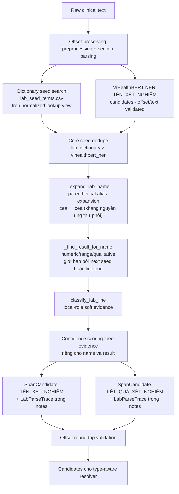

# Lab Parser — Implementation, workflow và trace

Tài liệu này là tài liệu hợp nhất cho **Lab parser layer** đã triển khai trong [`src/lab_parser.py`](../../src/lab_parser.py:1), theo đúng mục 6.4 của [`10_7_architecture.md`](10_7_architecture.md:374). Module nhận lab-name seed từ **2 nguồn**: curated dictionary (`lab_seed_terms.csv`) và ViHealthBERT NER candidate; sau đó mở rộng name span sang parenthetical alias, tìm kết quả (numeric/range/qualitative), gắn local-role evidence và nội bộ pairing name–result, rồi trả về `SpanCandidate` cho `TÊN_XÉT_NGHIỆM` và `KẾT_QUẢ_XÉT_NGHIỆM`. Module **không** quyết định entity canonical cuối, không chạy assertion và không phụ thuộc section cứng.

## 1. Trạng thái triển khai

Các thành phần đã có trong [`src/lab_parser.py`](../../src/lab_parser.py:1):

- [`LabSeed`](../../src/lab_parser.py:132): dataclass chuẩn hoá mọi lab-name seed trước khi result pairing (`start`, `end`, `seed_source`, `seed_term`, `seed_confidence`).
- [`LabPair`](../../src/lab_parser.py:144): dataclass giữ cặp name–result đã ghép (`name_start`, `name_end`, `name_text`, `result_start`, `result_end`, `result_text`, `result_kind`, `unit`).
- [`LabParseTrace`](../../src/lab_parser.py:158): trace debug đầy đủ (rule id, local role, dictionary term, name span, result span, result kind, unit, evidence, seed source/confidence), được serialize vào `SpanCandidate.notes` dạng JSON.
- [`_RESULT_VALUE_RE`](../../src/lab_parser.py:75): regex biên dịch trước, nhận diện ba dạng kết quả xét nghiệm:
  - *Range/trend*: `2.0 -> 3.2`, `2.0–3.0`, `tăng từ 2.0 lên 3.2`, `đạt đỉnh 6.7`.
  - *Qualitative*: `âm tính`, `dương tính`, `bình thường`, `không có gì đáng chú ý`, `trong giới hạn bình thường`.
  - *Numeric*: số đơn giản, số + unit (`537 mg/dl`), số + `x1` modifier.
- `_dictionary_lab_seeds()`: tạo seed từ curated terms trong [`lab_seed_terms.csv`](../../data_resources/lab_seed_terms.csv:1), mỗi term được tìm trên `normalized_text` rồi map ngược raw offset qua `OffsetMapper`.
- `_ner_lab_seeds()`: nhận `SpanCandidate` từ ViHealthBERT NER, chỉ dùng candidate `type_candidate="TÊN_XÉT_NGHIỆM"` và offset/text round-trip hợp lệ làm seed.
- [`_expand_lab_name()`](../../src/lab_parser.py:331): mở rộng span từ name core sang parenthetical alias, ví dụ `cea` → `cea (kháng nguyên ung thư phôi)`. Dùng whitespace‑only trim để giữ `)` trong span.
- [`_find_result_for_name()`](../../src/lab_parser.py:393): tìm kết quả phù hợp ngay sau name end, giới hạn bởi next seed start hoặc line end. Thứ tự ưu tiên: numeric > range > qualitative.
- [`classify_lab_line()`](../../src/lab_parser.py:445): gắn local role cho dòng chứa candidate (`lab_subsection_item`, `lab_bullet_item`, `lab_numbered_item`, `lab_section_header`, `lab_context_line`, `lab_like_line`, `neutral_line`).
- [`parse_lab_candidates()`](../../src/lab_parser.py:588): hàm pipeline chính — gom seed từ dictionary/NER, dedupe theo span với priority dictionary > NER, expand name, pair result, tính confidence theo evidence, trả `SpanCandidate[]` gồm cả `TÊN_XÉT_NGHIỆM` và `KẾT_QUẢ_XÉT_NGHIỆM`.
- [`LAB_UNITS`](../../src/lab_parser.py:37): danh sách unit xét nghiệm hỗ trợ (`mg/dl`, `mmol/l`, `g/dl`, `u/l`, `%`, …).

Quy tắc offset cốt lõi (giống các layer khác trong pipeline):

- Seed được tìm trên `normalized_text`, sau đó map ngược raw offset qua `OffsetMapper` — không bao giờ suy ra `text`/`position` từ chuỗi normalized.
- Name expansion và result detection chỉ thao tác trên `raw_text`, không bao giờ chỉnh sửa nội dung.
- Mọi candidate bị loại nếu `raw_text[start:end] != text` (kiểm tra tường minh trong vòng lặp output).
- Mọi span dùng quy ước half‑open `[start, end)`, đồng nhất với toàn bộ codebase.

## 2. Workflow tổng quát



### Input và output của layer

```text
Input:
  doc: ClinicalDocument       (đã parse section/line, có normalized maps)
  lab_terms: Sequence[str]    # curated alias seeds (lab_seed_terms.csv)
  ner_candidates: Optional[Sequence[SpanCandidate]]  # ViHealthBERT TÊN_XÉT_NGHIỆM

Output:
  SpanCandidate[]  với type_candidate ∈ {"TÊN_XÉT_NGHIỆM", "KẾT_QUẢ_XÉT_NGHIỆM"}
```

Output vẫn là **candidate**, không phải entity cuối:

```python
# TÊN_XÉT_NGHIỆM candidate
SpanCandidate(
    file_id="demo",
    text="cea (kháng nguyên ung thư phôi)",
    start=10,
    end=41,
    type_candidate="TÊN_XÉT_NGHIỆM",
    section_type="HOSPITAL_ASSESSMENT",
    subsection_type="LAB_RESULT_SECTION",
    source=["lab_parser", "lab_dictionary", "local_structure"],
    confidence=0.90,
    notes="{...LabParseTrace JSON...}",
)

# KẾT_QUẢ_XÉT_NGHIỆM candidate (paired)
SpanCandidate(
    file_id="demo",
    text="4.9",
    start=55,
    end=58,
    type_candidate="KẾT_QUẢ_XÉT_NGHIỆM",
    section_type="HOSPITAL_ASSESSMENT",
    subsection_type="LAB_RESULT_SECTION",
    source=["lab_parser", "result_detection", "paired_with_dictionary_name"],
    confidence=0.88,
    notes="{...LabParseTrace JSON...}",
)
```

## 3. Trách nhiệm của từng thành phần

## 3.1 Seed discovery (`_dictionary_lab_seeds`, `_ner_lab_seeds`)

Hai nguồn seed song song:

| Nguồn | Priority | Confidence base | Mô tả |
|---|---|---|---|
| `lab_dictionary` | 2 (cao nhất) | 0.70 | Từ `lab_seed_terms.csv` — precision cao nhất, được ưu tiên khi overlap với NER. |
| `vihealthbert_ner` | 1 | 0.66 | ViHealthBERT `TÊN_XÉT_NGHIỆM` candidate — recall fallback cho prose/narrative. |

Cả hai nguồn đều:

- Tìm core span trên `normalized_text`, map ngược raw offset qua `OffsetMapper`.
- Trim whitespace và kiểm tra word boundary (`_is_word_boundary`) trước khi chấp nhận span.
- Kiểm tra offset hợp lệ (`0 ≤ start < end ≤ len(raw_text)`) và text round‑trip (`raw_text[start:end] == candidate.text` cho NER seeds).

### Deduplication (`_dedupe_lab_seeds`)

Khi hai nguồn cho cùng span `(start, end)`, lựa chọn theo: `(priority, confidence, term_length)`. Priority `lab_dictionary` > `vihealthbert_ner`.

## 3.2 Name expansion (`_expand_lab_name`)

Mở rộng name span để bao gồm parenthetical alias/description ngay phía sau name core.

| Input | Output |
|---|---|
| `cea` | `cea (kháng nguyên ung thư phôi)` |
| `hct` | `hct (hematocrit)` |
| `k` | `k (kali)` |

Cơ chế:

- Dùng `_PAREN_DESCRIPTION_RE = \s*\([^)]*\)\s*` match ngay sau core end.
- Nếu match, mở rộng đến match end và trim whitespace hai đầu.
- **Whitespace‑only trim** — không dùng `SPAN_TRIM_CHARS` vì `)` là ký tự đóng ngoặc hợp lệ cần giữ trong span.

## 3.3 Result detection (`_find_result_for_name`)

Tìm kết quả xét nghiệm phù hợp với một name seed, giới hạn trong cùng dòng và không vượt quá seed tiếp theo.

### Thứ tự ưu tiên

1. **Numeric**: `0.03`, `537`, `5.4`, `26.7`, `1.8`, `26,3` (comma decimal được hỗ trợ qua `(?:[.,]\d+)`).
2. **Range**: `2.0 -> 3.2`, `1.1-->0.8`, `đạt đỉnh 6.7`, `tăng từ 2.0 lên 3.2`.
3. **Qualitative**: `âm tính`, `dương tính`, `bình thường`, `không ghi nhận gì bất thường`, `trong giới hạn bình thường`.

Thuật toán:

```
matches = _find_all_result_matches(raw_text, name_end, max_end)
for m in matches:
    if m.numeric_value:
        return m
for m in matches:
    if m.range_from:
        return m
for m in matches:
    if m.qualitative:
        return m
```

Thứ tự này tránh việc nhận nhầm qualifier word như *tăng* là kết quả khi có numeric value ở phía sau.

### Regex components

| Pattern | Example matches |
|---|---|
| Range/trend | `2.0 -> 3.2`, `creatinine 2.0 -> 3.2`, `đạt đỉnh 6.7`, `1.1-->0.8` |
| Qualitative | `âm tính x1`, `dương tính`, `bình thường`, `không có gì đáng chú ý`, `trong giới hạn bình thường` |
| Numeric | `537`, `5.4 mg/dl`, `26,3`, `0.03`, `14,43` |
| Percentage | `76,4%` |

## 3.4 Local‑role classifier (`classify_lab_line`)

| Role | Score bonus | Khi nào được gán |
|---|---|---|
| `lab_subsection_item` | +0.07 | Line có `subsection_type == "LAB_RESULT_SECTION"` |
| `lab_bullet_item` | +0.07 | Line bắt đầu bằng `- * •` và có lab section marker |
| `lab_numbered_item` | +0.07 | Line bắt đầu bằng `\d+[.)]` và có lab section marker |
| `lab_section_header` | +0.04 | Line có lab section marker nhưng không phải bullet/numbered |
| `lab_context_line` | +0.04 | Line có lab line cue word (`kết quả`, `xét nghiệm`, `chỉ số`, `nồng độ`, `định lượng`) |
| `lab_like_line` | +0.03 | Line có pattern giống result value (`_RESULT_VALUE_RE` match) |
| `neutral_line` | 0.0 | Không có evidence lab nào |

## 3.5 Confidence scoring (`_score_lab_name`, `_score_lab_result`)

### Name confidence

```text
score = seed_base +
    (+0.08 nếu có result paired) +
    (+0.05 nếu numeric / +0.04 nếu range / +0.03 nếu qualitative) +
    (+0.07 nếu strong_lab_role / +0.04 nếu weak_lab_role / +0.03 nếu lab_like_line)
```

| seed_base | Nguồn |
|---|---|
| 0.70 | `lab_dictionary` |
| 0.66 | `vihealthbert_ner` |

### Result confidence

```text
score = 0.72 [base] +
    (+0.06 numeric / +0.05 range / +0.04 qualitative) +
    (+0.04 nếu paired với dictionary name) +
    (+0.06 strong_lab_role / +0.03 weak_lab_role / +0.02 lab_like_line)
```

Result base (0.72) cao hơn name base vì kết quả là giá trị quan sát trực tiếp, ít phụ thuộc vào dictionary coverage.

## 4. Patterns hỗ trợ và ví dụ trace

### 4.1 `name: value` — Colon-separated

**Input**: `- troponin: 0.03`

**Candidates**:

| Type | Text | Start | End | Conf |
|---|---|---|---|---|
| `TÊN_XÉT_NGHIỆM` | `troponin` | 47 | 55 | 0.90 |
| `KẾT_QUẢ_XÉT_NGHIỆM` | `0.03` | 57 | 61 | 0.88 |

**Trace** (name candidate):
```json
{
  "dictionary_term": "troponin",
  "evidence": ["lab_dictionary", "result_paired", "numeric_result", "lab_subsection_item"],
  "local_role": "lab_subsection_item",
  "name_span": [47, 55],
  "result_kind": "numeric",
  "result_span": [57, 61],
  "rule_id": "lab_name_seed_plus_result_pairing",
  "seed_source": "lab_dictionary",
  "seed_confidence": 1.0,
  "unit": null
}
```

### 4.2 `name = value unit` — Equals-separated

**Input**: `- kali = 5.4 mmol/l`

**Result**: `5.4 mmol/l` (unit `"mmol/l"`, kind `"numeric"`).

### 4.3 `name (description): value` — Parenthetical alias

**Input**: `Kết quả xét nghiệm: cea (kháng nguyên ung thư phôi) tăng nhẹ lên 4.9`

**Name expansion**: `cea (kháng nguyên ung thư phôi)` (span bao gồm cả `)`).

**Candidates**:

| Type | Text | Start | End | Conf |
|---|---|---|---|---|
| `TÊN_XÉT_NGHIỆM` | `cea (kháng nguyên ung thư phôi)` | 20 | 51 | 0.90 |
| `KẾT_QUẢ_XÉT_NGHIỆM` | `4.9` | 65 | 68 | 0.88 |

### 4.4 `name value reference-range unit` — Numeric with unit

**Input**: `- glucose 537 mg/dl`

**Result**: `537 mg/dl` (unit `"mg/dl"`, kind `"numeric"`).

### 4.5 `name value -> value` — Range / trend

**Input**: `- creatinine là 2.0 -> 3.2`

**Result**: `2.0 -> 3.2` (kind `"range"`).

### 4.6 Qualitative result

**Input**: `- troponin âm tính x1`

**Result**: `âm tính x1` (kind `"qualitative"`).

Regex ưu tiên qualitative trước numeric nên `âm tính x1` không bị match thành `1`.

### 4.7 Multiple pairs on same line

**Input**: `- WBC: 14,43; NEUT%: 76,4`

**Candidates**: 2 name + 2 result.

| Type | Text | Start | End |
|---|---|---|---|
| `TÊN_XÉT_NGHIỆM` | `WBC` | x | x |
| `KẾT_QUẢ_XÉT_NGHIỆM` | `14,43` | x+5 | x+10 |
| `TÊN_XÉT_NGHIỆM` | `NEUT%` | x+12 | x+17 |
| `KẾT_QUẢ_XÉT_NGHIỆM` | `76,4` | x+19 | x+23 |

Boundary giữa các seed được duy trì nhờ `next_seed_start`: seed `NEUT%` không scan về bên trái, và `WBC` không scan quá phải sang `NEUT%`.

### 4.8 Comma decimal

**Input**: `- huyết khối 26,3`

**Result**: `26,3` — comma được xử lý qua `(?:[.,]\d+)` trong regex.

### 4.9 Name without result

**Input**: `- bilirubin`

**Candidates**: Vẫn output `TÊN_XÉT_NGHIỆM` với confidence thấp hơn (không có bonus `result_paired` +0.08). Trace ghi `result_span: null`, `result_kind: "unknown"`.

## 5. Cấu trúc LabParseTrace

```json
{
  "rule_id": "lab_name_seed_plus_result_pairing",
  "local_role": "lab_subsection_item",
  "dictionary_term": "creatinine",
  "name_span": [20, 30],
  "result_span": [40, 44],
  "result_kind": "numeric",
  "unit": null,
  "evidence": ["lab_dictionary", "result_paired", "numeric_result", "lab_subsection_item"],
  "seed_source": "lab_dictionary",
  "seed_confidence": 1.0
}
```

Các `rule_id` hiện có:
- `lab_name_seed_plus_result_pairing` — name có result paired.
- `lab_result_from_name_seed_pairing` — result từ pairing.
- `lab_name_seed_no_result` — name không tìm thấy result.

## 6. Test và verification

### 6.1 Unit tests

File [`tests/test_lab_parser.py`](../../tests/test_lab_parser.py:1) gồm 19 tests:

| Test | Mô tả |
|---|---|
| `test_simple_name_value_colon` | `troponin: 0.03` → 1 name + 1 result |
| `test_name_value_whitespace` | `bạch cầu 13.9` → whitespace-separated |
| `test_name_parenthetical_description_with_value` | `cea (kháng nguyên ung thư phôi) tăng nhẹ lên 4.9` |
| `test_name_with_unit_value` | `glucose 537 mg/dl` → unit extraction |
| `test_range_value_dash` | `creatinine là 2.0 -> 3.2` → range |
| `test_multiple_pairs_on_same_line` | `WBC: 14,43; NEUT%: 76,4` → multi-pair |
| `test_name_with_equals_sign` | `kali = 5.4 mmol/l` → equals-separated |
| `test_qualitative_result` | `troponin âm tính x1` → qualitative |
| `test_classify_lab_line_roles` | Line role classification |
| `test_bullet_lab_item_role` | Bullet item role under hospital-assessment heading |
| `test_lab_subsection_boosts_confidence` | Subsection context > narrative |
| `test_lab_name_without_result_still_candidate` | Name xuất ra dù không có result |
| `test_vihealthbert_ner_seed_for_lab_name` | NER seed integration |
| `test_dictionary_priority_over_ner_for_same_span` | Dictionary > NER |
| `test_offset_round_trip_all_candidates` | 8 candidates, all offsets valid |
| `test_trend_improvement_value` | `glucose cải thiện thành 367` |
| `test_nested_subsection_lab_detection` | `Kết quả xét nghiệm xét nghiệm` |
| `test_comma_decimal_parsing` | `26,3` comma decimal |
| `test_no_false_lab_on_imaging_line` | Non-lab term không tạo candidate |

### 6.2 Real input verification

Đã kiểm thử với 6 trường hợp từ tập input thật:

- `file5_creatinine`: `- creatinine 5.7`
- `file38_glucose`: `- glucose 537 / - bun (ure) 3 / - cr (creatinine) 1.2`
- `file76_troponin`: `- troponin là 0.03 / - creatinine là 2.0 -> 3.2 / - k (kali) là 5.4`
- `file84_lab_panel`: `- bạch cầu 26.7 / - kali 3.2 / - troponin 0.01 / - lactate 1.8`
- `file66_hct`: `- hct (hematocrit) 8.126.3`
- `file10_cea`: `cea (kháng nguyên ung thư phôi) tăng nhẹ lên 4.9`

Tất cả offset đều round-trip chính xác: `doc.raw_text[start:end] == candidate.text`.

## 7. Thay đổi resources

### 7.1 `lab_seed_terms.csv`

Thêm 5 terms mới để tăng recall cho Vietnamese clinical notes:

| Term | Ghi chú |
|---|---|
| `bạch cầu` | White blood cell count (xuất hiện trong nhiều input) |
| `kali` | Potassium (xuất hiện trong `file38`, `file84`) |
| `cea` | Carcinoembryonic antigen (`file10`) |
| `huyết khối` | INR-related (`file16`) |
| `k` | Ký hiệu tắt của Kali (`file76`) |

## 7.2 Seed expansion workflow

```
lab_seed_terms.csv (curated)
       |
       ▼
   normalize_for_matching
       |
       ▼
   find normalized_term in doc.normalized_text
       |
       ▼
   OffsetMapper.recover_raw_span_from_normalized_match
       |
       ▼
   trim_span + is_word_boundary validation
       |
       ▼
   LabSeed (start, end, text, seed_source="lab_dictionary")
```

Nếu seed không qua nổi word boundary hoặc offset round-trip, seed sẽ bị loại — đây là filter quan trọng để tránh false positive từ substring match (ví dụ `k` trong `Kết quả`).

---

## 8. So sánh với Drug Parser

| Aspect | Drug Parser | Lab Parser |
|---|---|---|
| Source seeds | 3 (dictionary, NER, RxNorm catalog deprecated) | 2 (dictionary, NER) |
| Boundary expansion | Strength/dose/form/route/frequency/PRN | Parenthetical alias expansion |
| Result pairing | Không — drug là single entity | Có — name và result là hai entity riêng |
| Evidence sources | Drug core + dose structure + local role + RxNorm | Dictionary + result kind + local role |
| Entity types | 1 (`THUỐC`) | 2 (`TÊN_XÉT_NGHIỆM`, `KẾT_QUẢ_XÉT_NGHIỆM`) |
| Internal pairing | Không cần | Name ↔ result qua `LabPair` (dùng cho resolver) |
| Result patterns | Không áp dụng | Numeric, range, qualitative, percentage |
| Linker integration | Optional RxNorm (confidence boost) | Chưa yêu cầu — lab không có ontology tương đương |
