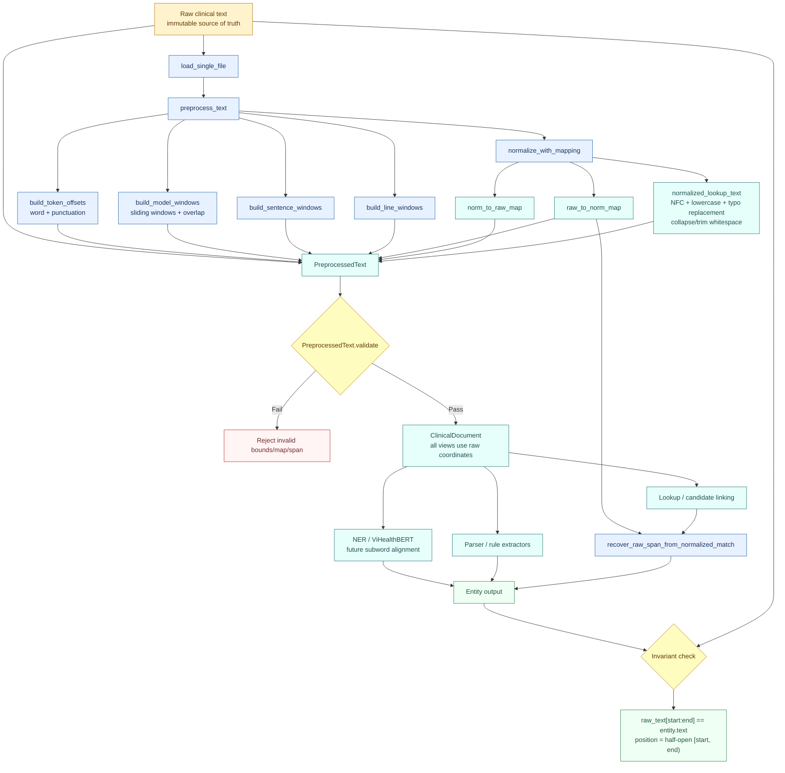

# Implementation log — Offset-preserving pre-processing

Ngày thực hiện: 2026-07-10  
Phạm vi: layer `6.1 Offset-preserving preprocessing` trong `../00_overview/00_architecture_hybrid_vihealthbert.md`.

## 1. Mục tiêu đã triển khai

Layer mới tạo các view phục vụ model, parser và lookup nhưng mọi span vẫn dùng offset của chuỗi input nguyên bản:

```text
raw_text
normalized_lookup_text
norm_to_raw_map
raw_to_norm_map
line_windows
sentence_windows
model_windows
token_offsets
```

Quy ước offset hiện tại là half-open `[start, end)`. Invariant bắt buộc:

```python
raw_text[start:end] == span.text
```

Normalized view không được dùng trực tiếp để ghi `text` hoặc `position` của entity.

### 1.1 Workflow pipeline



Luồng chính bảo đảm ba nguyên tắc:

1. `raw_text` luôn là nguồn dữ liệu chuẩn và không bị sửa đổi.
2. Normalization chỉ phục vụ matching/lookup; mọi kết quả phải được ánh xạ ngược về raw coordinates.
3. Entity chỉ được xuất sau khi thỏa invariant `raw_text[start:end] == entity.text`.

## 2. Thay đổi mã nguồn

### `src/preprocessing.py` — file mới

Thêm API trung tâm:

```python
preprocess_text(raw_text, max_window_chars=512, overlap_chars=64)
```

Kết quả là `PreprocessedText`, gồm raw/normalized views và các cấu trúc sau:

- `TextSpan`: span raw cơ bản.
- `TextWindow`: line/sentence/model window có `window_id`, `kind`.
- `TokenOffset`: token word/punctuation có raw offset và optional normalized offset.
- `build_line_windows`: tách dòng, bảo toàn `LF`, `CRLF`, dòng rỗng và raw offset.
- `build_sentence_windows`: tách sentence-like window bảo thủ theo `.`, `!`, `?`, newline.
- `build_model_windows`: tạo sliding windows có overlap, ưu tiên cắt tại whitespace/punctuation.
- `build_token_offsets`: tokenizer nhẹ cho word/punctuation, chưa phụ thuộc tokenizer của backbone.
- `PreprocessedText.validate`: kiểm tra chiều dài map, bounds và round-trip của tất cả span.

`model_windows` là character windows generic. Khi tích hợp ViHealthBERT, tokenizer-specific windows/subword offsets sẽ được xây trên raw window này, không thay thế raw coordinates.

### `src/normalization.py`

Cập nhật `normalize_with_mapping` để mapping luôn trỏ về đúng chuỗi input được truyền vào, kể cả input Unicode decomposed như:

```text
e + COMBINING ACUTE ACCENT
```

Normalization lookup hiện hỗ trợ đồng thời:

- Unicode NFC view.
- Lowercase cho matching.
- Typo/noise replacement hiện có.
- Collapse whitespace và trim ở lookup view.
- Character mapping ngược về original raw string.

Thay đổi quan trọng: không còn dùng chuỗi NFC làm “raw text” nội bộ để xuất offset. NFC chỉ là lookup view có source span về input gốc.

### `src/offset_mapper.py`

`recover_raw_span_from_normalized_match` ưu tiên reverse map `raw_to_norm_map`. Điều này giúp recover đầy đủ:

- Nhiều raw code point tạo thành một normalized character.
- Một typo span raw được thay bởi chuỗi normalized dài/ngắn khác nhau.
- Whitespace run bị collapse thành một space lookup.

### `src/models.py`

`ClinicalDocument` được mở rộng với:

```text
line_windows
sentence_windows
model_windows
token_offsets
```

`metadata` truyền từ caller được giữ lại thay vì bị `__post_init__` ghi đè hoàn toàn.

### `src/io_utils.py`

`load_single_file` chuyển sang gọi `preprocess_text` và gắn toàn bộ preprocessing views vào `ClinicalDocument`.

Metadata mới:

```json
{"offset_convention": "half-open"}
```

Các field cũ `normalized_text`, `norm_to_raw_map`, `raw_to_norm_map` vẫn được giữ để tương thích với pipeline hiện tại.

### 2.1 Ví dụ end-to-end theo workflow pipeline

Ví dụ này đi đúng thứ tự của diagram: file raw → `load_single_file` → `preprocess_text` → các parallel view → validation → `ClinicalDocument` → downstream branches → recover raw span → entity output → invariant check.

> **Ranh giới implementation hiện tại:** `load_single_file` tự động chạy đến bước tạo `ClinicalDocument`. Parser, rule extractors, lookup/linking và NER là các downstream consumer phải được caller gọi riêng. ViHealthBERT/subword alignment chưa được triển khai. Các bước chưa có implementation được đánh dấu rõ, không được mô tả như đã chạy.

#### 2.1.1 Call tree đầy đủ

```text
load_single_file(filepath)
├─ Path(filepath)
├─ file_id = path.stem
├─ open(..., encoding="utf-8").read() -> raw_text
├─ preprocess_text(raw_text, 512, 64)
│  ├─ normalize_with_mapping(raw_text, for_matching=True)
│  │  ├─ _unicode_nfc_view(raw_text)
│  │  │  ├─ nhóm base character + combining marks
│  │  │  ├─ NFC từng grapheme-like cluster
│  │  │  └─ giữ source span (raw_start, raw_end) cho mỗi ký tự NFC
│  │  ├─ sort NOISE_NORMALIZATION theo typo dài giảm dần
│  │  ├─ scan NFC view từ trái sang phải
│  │  │  ├─ nếu prefix khớp typo -> emit replacement + source span typo
│  │  │  ├─ nếu whitespace run -> emit một space + source span cả run
│  │  │  └─ ngược lại -> lowercase character + source span gốc
│  │  ├─ bỏ space đầu/cuối lookup view
│  │  ├─ dựng norm_to_raw_map từ source_start
│  │  └─ dựng raw_to_norm_map; raw bị strip -> -1
│  ├─ build_line_windows(raw_text)
│  │  ├─ tìm CRLF / CR / LF
│  │  ├─ span kết thúc trước newline
│  │  └─ emit trailing line
│  ├─ build_sentence_windows(raw_text)
│  │  ├─ tìm . ! ? hoặc newline boundary
│  │  ├─ punctuation thuộc sentence; newline không thuộc sentence
│  │  ├─ _trim_raw_span chỉ dịch start/end qua whitespace biên
│  │  └─ emit phần còn lại
│  ├─ build_model_windows(raw_text, 512, 64)
│  │  ├─ validate window params
│  │  ├─ hard_end = min(raw_len, start + max_chars)
│  │  ├─ _choose_window_end ưu tiên whitespace/punctuation
│  │  ├─ emit raw window
│  │  └─ nếu chưa hết: lùi overlap và căn start về word boundary
│  ├─ build_token_offsets(raw_text, raw_to_norm_map)
│  │  ├─ regex word hoặc punctuation trên raw
│  │  ├─ lấy raw [start, end)
│  │  ├─ project các raw index qua raw_to_norm_map
│  │  └─ normalized bounds = [min(mapped), max(mapped) + 1)
│  ├─ PreprocessedText(...)
│  ├─ PreprocessedText.validate()
│  │  ├─ kiểm tra len(norm_to_raw_map) == len(normalized_lookup_text)
│  │  ├─ kiểm tra len(raw_to_norm_map) == len(raw_text)
│  │  ├─ kiểm tra span.end <= len(raw_text)
│  │  └─ kiểm tra raw_text[span.start:span.end] == span.text
│  └─ return PreprocessedText
├─ ClinicalDocument(...)
│  └─ __post_init__
│     ├─ tính char_len
│     ├─ tính line_count
│     └─ merge metadata caller: offset_convention = half-open
└─ return ClinicalDocument

Downstream — caller gọi riêng
├─ parse_document_sections(doc)
│  ├─ iter_raw_lines
│  ├─ strip prefix / split key-value / classify header
│  ├─ gán main section + subsection
│  └─ ghi doc.lines, doc.sections, metadata
├─ rule extractors / lookup
│  ├─ normalize term
│  ├─ find term trong doc.normalized_text
│  ├─ recover_raw_span_from_normalized_match
│  ├─ trim + word-boundary + section/context filters
│  └─ make_candidate từ raw substring
├─ NER / ViHealthBERT [chưa triển khai]
│  └─ model window -> subwords -> raw alignment
└─ final entity
   ├─ text = raw_text[start:end]
   ├─ position = [start, end]
   └─ invariant check
```

#### 2.1.2 Execution trace chi tiết trên input mẫu

Các mục dưới đây dùng cùng input của **Bước 1**, không phải ví dụ độc lập.

##### Trace A — `load_single_file`

| Thứ tự | Phép toán | Giá trị |
|---:|---|---|
| A1 | `Path("example_note.txt")` | path object |
| A2 | `path.stem` | `"example_note"` |
| A3 | đọc UTF-8 | raw string dài `59` |
| A4 | gọi `preprocess_text(raw_text)` | defaults `max_window_chars=512`, `overlap_chars=64` |
| A5 | nhận `PreprocessedText` đã validate | 8 parallel views |
| A6 | dựng `ClinicalDocument` | raw/maps/windows/tokens được gắn nguyên trạng |

##### Trace B — `normalize_with_mapping`

**B1. Unicode NFC view.** Input mẫu đã ở NFC, nên text không đổi. Mỗi ký tự có source span một ký tự, ví dụ `Ệ` raw `[3,4)` → NFC `Ệ` với source `[3,4)`. Nếu input decomposed, một ký tự NFC có thể mang source span nhiều raw code point.

**B2. Chuẩn bị typo replacements.** Map typo được NFC + lowercase, rồi sort theo độ dài typo giảm dần để chuỗi dài được ưu tiên. Input mẫu không chứa typo trong map → không replacement nào kích hoạt.

**B3. Scan và lowercase.** Case thay đổi nhưng độ dài không đổi:

```text
"BỆNH" -> "bệnh"
"WBC"  -> "wbc"
```

Source span của từng output character vẫn trỏ về raw character tương ứng.

**B4. Collapse whitespace runs.** Mọi run thỏa `char.isspace()` được thay bằng đúng một space:

```text
raw [0,2)   = "  "  -> lookup candidate " "
raw [11,12) = "\t"  -> một lookup space
raw [21,22) = "\n"  -> một lookup space
raw [57,59) = "  "  -> lookup candidate " "
```

Với input chính xác, các mốc quanh symptom là:

```text
raw    [2,6)   = "BỆNH" -> normalized [0,4)  = "bệnh"
raw    [7,11)  = "nhân" -> normalized [5,9)  = "nhân"
raw    [11,12) = "\t"   -> normalized [9,10) = " "
raw    [12,20) = "đau bụng" -> normalized [10,18) = "đau bụng"
raw    [21,22) = "\n"   -> normalized [19,20) = " "
```

**B5. Trim lookup view.** Space sinh từ raw `[0,2)` và `[57,59)` bị bỏ. Raw không bị xóa; các raw index đó nhận reverse mapping `-1`.

**B6. Dựng maps.** Với mỗi normalized character `i`, `norm_to_raw_map[i] = source_start`. Sau đó khởi tạo `raw_to_norm_map` toàn `-1`; mỗi source span `[source_start, source_end)` điền normalized index đầu tiên tạo ra nó.

```python
# Các điểm kiểm chứng đại diện
norm_to_raw_map[0] == 2    # normalized "b" <- raw "B"
norm_to_raw_map[10] == 12  # normalized "đ" <- raw "đ"
raw_to_norm_map[0] == -1   # leading whitespace bị trim
raw_to_norm_map[1] == -1
raw_to_norm_map[12] == 10
raw_to_norm_map[19] == 17  # raw "g" cuối của "bụng"
raw_to_norm_map[57] == -1  # trailing whitespace bị trim
raw_to_norm_map[58] == -1
```

**B7. Kết quả normalization.** Không dữ liệu nào từ normalized view được dùng trực tiếp làm entity text:

```text
normalized_lookup_text = "bệnh nhân đau bụng. wbc: 14,43 - aspirin 81 mg po daily"
raw length              = 59
normalized length       = 55
```

##### Trace C — `build_line_windows`

1. Khởi tạo `line_start=0`.
2. Regex tìm `LF` tại raw index `21` → emit `[0,21)`, rồi đặt `line_start=22`.
3. Tìm `LF` tại raw index `32` → emit `[22,32)`, rồi đặt `line_start=33`.
4. Không còn newline → emit trailing span `[33,59)`.
5. `include_empty=True` nên dòng rỗng cũng sẽ được emit nếu có; input này không có dòng rỗng.

Kết quả chính là `line_windows` ở **Bước 4**.

##### Trace D — `build_sentence_windows`

1. Khởi tạo `segment_start=0`.
2. Gặp `.` raw `[20,21)`; punctuation thuộc boundary → candidate `[0,21)`, trim leading spaces → emit `[2,21)`.
3. Gặp `LF` raw `[21,22)`; newline không thuộc sentence; đoạn `[21,21)` rỗng → không emit; `segment_start=22`.
4. Gặp `LF` raw `[32,33)` → trim `[22,32)` → emit `[22,32)`.
5. Hết boundary → trim trailing segment `[33,59)` thành `[33,57)` → emit.

Không lowercase, collapse hay sửa text trong sentence span; chỉ dịch biên qua whitespace.

##### Trace E — `build_model_windows`

1. Validate `512 > 0`, `0 <= 64 < 512` → pass.
2. `start=0`; `hard_end=min(59, 0+512)=59`.
3. `hard_end >= raw_len` → `_choose_window_end` trả `59` ngay.
4. Emit model window `[0,59)` chứa toàn bộ raw text.
5. `end >= raw_len` → break; không cần overlap window thứ hai.

Với document dài hơn 512, hàm mới tìm soft boundary từ `hard_end` lùi về nửa window, emit window, tính `next_start=end-overlap_chars`, rồi lùi thêm để tránh bắt đầu giữa word.

##### Trace F — `build_token_offsets`

Regex `\w+|[^\w\s]` chạy trên **raw**, không chạy trên lookup view:

```text
raw "BỆNH" -> word token
raw tab/newline/space -> bỏ qua
raw ".", ":", ",", "-" -> punctuation token riêng
```

Cho token `đau`:

1. Regex match raw `[12,15)`.
2. Slice reverse map `raw_to_norm_map[12:15]` → `[10,11,12]`.
3. Bỏ index `<0` → không có index bị bỏ.
4. `normalized_start=min(...)=10`.
5. `normalized_end=max(...)+1=13`.
6. Emit `TokenOffset("đau", 12, 15, token_id=2, 10, 13)`.

Cho token `bụng`: raw `[16,20)` → mapped `[14,15,16,17]` → normalized `[14,18)`. Cho `.`: raw `[20,21)` → mapped `[18]` → normalized `[18,19)`.

##### Trace G — `PreprocessedText` và validation

Sau khi sáu output groups được dựng, constructor giữ chúng song song; không view nào thay thế `raw_text`. `validate()` chạy tuần tự:

```python
assert len(norm_to_raw_map) == 55
assert len(normalized_lookup_text) == 55
assert len(raw_to_norm_map) == 59
assert len(raw_text) == 59

for span in line_windows + sentence_windows + model_windows + token_offsets:
    assert span.end <= 59
    assert raw_text[span.start:span.end] == span.text
```

Bất kỳ check nào fail → `ValueError` → `preprocess_text` không trả object → loader không tạo `ClinicalDocument` từ dữ liệu lỗi.

##### Trace H — `ClinicalDocument.__post_init__`

1. Copy metadata caller `{"offset_convention": "half-open"}`.
2. Tạo metadata mặc định từ raw: `char_len=59`, `line_count=3`.
3. Merge metadata caller vào defaults.
4. Không normalize lại, không tính lại maps, không sửa windows/tokens.

```json
{
  "char_len": 59,
  "line_count": 3,
  "offset_convention": "half-open"
}
```

##### Trace I — parser/rule extractor branch

Đây là downstream call riêng:

```python
from src.section_parser import parse_document_sections

parse_document_sections(doc)
```

Nội bộ parser:

1. `iter_raw_lines` dùng `splitlines(keepends=True)` để cộng offset tuyệt đối.
2. Với mỗi line: bỏ prefix trình bày, thử split key/value tại colon, normalize để so alias, classify `header/subheader/key_value/bullet/free_text`.
3. Khi gặp header: cập nhật `current_main/current_sub`, tạo `Section` bằng raw offsets.
4. Tạo `Line` và gắn section context hiện hành.
5. Ghi `doc.lines`, `doc.sections` và parser metadata.

Input mẫu tối giản không có section header chuẩn, vì vậy parser vẫn tạo lines nhưng không gắn `CURRENT_HISTORY`. Do đó symptom extractor có section filter có thể không chấp nhận `đau bụng`. Đây là hành vi đúng của downstream rule, không phải lỗi offset preprocessing.

Khi document có context hợp lệ, `normalized_find_spans(doc, "đau bụng")` thực hiện chi tiết:

1. Normalize term → `"đau bụng"`.
2. Tìm trong `doc.normalized_text` → normalized `[10,18)`.
3. Gọi `recover_raw_span_from_normalized_match(10,18)`.
4. Reverse scan toàn `raw_to_norm_map`, lấy raw index có mapped norm trong `[10,18)` → raw indices `12..19`.
5. `raw_start=min=12`, `raw_end=max+1=20`.
6. Trim punctuation/whitespace → vẫn `[12,20)`.
7. Check word boundary → pass.
8. `make_candidate` lấy `text=doc.raw_text[12:20]`, không lấy lookup substring.

##### Trace J — lookup/linking branch

Lookup branch dùng normalized view để tăng recall, nhưng recover theo cùng quy trình reverse-map:

```python
lookup_start = doc.normalized_text.index("đau bụng")  # 10
lookup_end = 18
raw_span = mapper.recover_raw_span_from_normalized_match(10, 18)
assert raw_span == (12, 20)
```

Với typo expansion ở mục 2.2, nhiều normalized characters có thể cùng source raw span. Reverse map được ưu tiên để recover đủ typo span, thay vì giả định độ dài normalized bằng raw.

##### Trace K — model/NER branch

Hiện có:

```text
raw model window [0,59) -> text giữ nguyên -> absolute raw start/end
```

Chưa có:

```text
ViHealthBERT tokenizer -> subword IDs -> subword offsets -> NER logits -> decoded entity
```

Contract bắt buộc khi triển khai: local subword span phải cộng raw `model_window.start`, resolve overlap, rồi output absolute raw `[start,end)`. Không được dùng token index hoặc normalized index làm entity position.

##### Trace L — final entity và invariant

Sau khi một downstream branch chấp nhận raw span `[12,20)`:

```python
entity = {
    "text": doc.raw_text[12:20],
    "position": [12, 20],
    "type": "TRIỆU_CHỨNG",
    "assertions": [],
}

start, end = entity["position"]
assert doc.raw_text[start:end] == entity["text"] == "đau bụng"
```

Toàn bộ provenance của entity:

```text
raw file bytes
-> UTF-8 raw_text
-> normalized lookup [10,18)
-> reverse map
-> raw span [12,20)
-> context/filter/candidate acceptance
-> entity.text = raw_text[12:20]
-> invariant pass
```

#### Bước 1 — Raw file là source of truth

File `example_note.txt` chứa nguyên văn case, tab, khoảng trắng đầu/cuối và `LF`:

```text
  BỆNH nhân	đau bụng.
WBC: 14,43
- aspirin 81 mg po daily
```

Chuỗi raw tương ứng:

```python
raw_text = "  BỆNH nhân\tđau bụng.\nWBC: 14,43\n- aspirin 81 mg po daily  "
assert len(raw_text) == 59
```

#### Bước 2 — Loader gọi preprocessing và tạo document

```python
from src.io_utils import load_single_file

doc = load_single_file("example_note.txt")
```

Bên trong lời gọi này, pipeline thực hiện:

```python
raw_text = file.read()
views = preprocess_text(raw_text)  # defaults: 512 chars, overlap 64 chars
views.validate()                   # được gọi trong preprocess_text

doc = ClinicalDocument(
    file_id="example_note",
    raw_text=raw_text,
    normalized_text=views.normalized_lookup_text,
    norm_to_raw_map=views.norm_to_raw_map,
    raw_to_norm_map=views.raw_to_norm_map,
    line_windows=views.line_windows,
    sentence_windows=views.sentence_windows,
    model_windows=views.model_windows,
    token_offsets=views.token_offsets,
    metadata={"offset_convention": "half-open"},
)
```

#### Bước 3 — Normalized lookup view và bidirectional maps

```text
doc.normalized_text
= "bệnh nhân đau bụng. wbc: 14,43 - aspirin 81 mg po daily"
```

Maps thỏa điều kiện kích thước:

```python
len(doc.norm_to_raw_map) == len(doc.normalized_text) == 55
len(doc.raw_to_norm_map) == len(doc.raw_text) == 59
```

Ví dụ mapping quanh lookup phrase `đau bụng`:

```text
normalized span [10, 18) -> "đau bụng"
raw span        [12, 20) -> "đau bụng"
```

#### Bước 4 — Structural/model views trên raw coordinates

`line_windows` không chứa newline trong `text`; offsets vẫn tuyệt đối trên raw document:

```json
[
  {"window_id": 0, "kind": "line", "start": 0,  "end": 21, "text": "  BỆNH nhân\tđau bụng."},
  {"window_id": 1, "kind": "line", "start": 22, "end": 32, "text": "WBC: 14,43"},
  {"window_id": 2, "kind": "line", "start": 33, "end": 59, "text": "- aspirin 81 mg po daily  "}
]
```

`sentence_windows` trim whitespace biên nhưng không sửa nội dung bên trong span:

```json
[
  {"window_id": 0, "kind": "sentence", "start": 2,  "end": 21, "text": "BỆNH nhân\tđau bụng."},
  {"window_id": 1, "kind": "sentence", "start": 22, "end": 32, "text": "WBC: 14,43"},
  {"window_id": 2, "kind": "sentence", "start": 33, "end": 57, "text": "- aspirin 81 mg po daily"}
]
```

Input dài 59 ký tự, nhỏ hơn default `max_window_chars=512`; do đó `model_windows` có đúng một raw window:

```json
[
  {
    "window_id": 0,
    "kind": "model",
    "start": 0,
    "end": 59,
    "text": "  BỆNH nhân\tđau bụng.\nWBC: 14,43\n- aspirin 81 mg po daily  "
  }
]
```

`token_offsets` — rút gọn tại phrase `đau bụng.`:

```json
[
  {"token_id": 2, "text": "đau",  "start": 12, "end": 15, "normalized_start": 10, "normalized_end": 13},
  {"token_id": 3, "text": "bụng", "start": 16, "end": 20, "normalized_start": 14, "normalized_end": 18},
  {"token_id": 4, "text": ".",    "start": 20, "end": 21, "normalized_start": 18, "normalized_end": 19}
]
```

#### Bước 5 — Validation pass và `ClinicalDocument` sẵn sàng

`preprocess_text` gọi `views.validate()` trước khi trả kết quả. Tất cả generated spans pass raw round-trip; document nhận metadata:

```json
{
  "char_len": 59,
  "line_count": 3,
  "offset_convention": "half-open"
}
```

Ví dụ validation trên token:

```python
assert doc.raw_text[12:15] == "đau"
assert doc.raw_text[16:20] == "bụng"
assert doc.raw_text[20:21] == "."
```

#### Bước 6 — Ba downstream branches

- Parser/rule extractors dùng `line_windows`, `sentence_windows` và raw offsets để tạo span candidates.
- Lookup/candidate linking match trên `doc.normalized_text`, sau đó bắt buộc recover về raw span.
- NER/ViHealthBERT dùng `model_windows`; tokenizer/subword alignment là layer tiếp theo nhưng vẫn phải trả raw coordinates.

Ví dụ lookup branch match `đau bụng`:

```python
from src.offset_mapper import OffsetMapper

lookup_text = "đau bụng"
lookup_start = doc.normalized_text.index(lookup_text)  # 10
lookup_end = lookup_start + len(lookup_text)           # 18

mapper = OffsetMapper(
    raw_text=doc.raw_text,
    normalized_text=doc.normalized_text,
    norm_to_raw_map=doc.norm_to_raw_map,
    raw_to_norm_map=doc.raw_to_norm_map,
)
raw_span = mapper.recover_raw_span_from_normalized_match(
    lookup_start,
    lookup_end,
)
assert raw_span == (12, 20)
```

#### Bước 7 — Entity output chỉ lấy text từ raw

```python
raw_start, raw_end = raw_span
entity = {
    "text": doc.raw_text[raw_start:raw_end],
    "position": [raw_start, raw_end],
    "type": "TRIỆU_CHỨNG",
    "assertions": [],
}
```

Output:

```json
{
  "text": "đau bụng",
  "position": [12, 20],
  "type": "TRIỆU_CHỨNG",
  "assertions": []
}
```

#### Bước 8 — Invariant cuối pipeline

```python
start, end = entity["position"]
assert doc.raw_text[start:end] == entity["text"] == "đau bụng"
assert doc.normalized_text[10:18] == "đau bụng"
```

Kết luận luồng dữ liệu:

```text
example_note.txt
  -> load_single_file
  -> preprocess_text
  -> normalize/maps + line/sentence/model/token views
  -> validate: pass
  -> ClinicalDocument
  -> lookup match [10, 18)
  -> recover raw span [12, 20)
  -> entity.text lấy từ raw_text[12:20]
  -> invariant: pass
```

### 2.2 Ví dụ normalization làm thay đổi độ dài

Input:

```python
raw_text = "  cảm giác  khó chịu; atenololtrong ngày  "
views = preprocess_text(raw_text)
```

Output lookup và mapping:

```text
normalized_lookup_text == "cảm giác khó chịu; atenolol trong ngày"
```

| Lookup match | Lookup span | Raw span recovered | Raw text giữ nguyên |
|---|---:|---:|---|
| `cảm giác khó chịu` | `[0, 17)` | `[2, 20)` | `cảm giác  khó chịu` |
| `atenolol trong` | `[19, 33)` | `[22, 35)` | `atenololtrong` |

Ý nghĩa: whitespace kép và typo compound được normalize để lookup, nhưng output span vẫn trỏ đúng raw text. Cả hai đều pass:

```python
raw_text[2:20] == "cảm giác  khó chịu"
raw_text[22:35] == "atenololtrong"
```

## 3. Tests đã thêm

File mới: `tests/test_preprocessing.py`.

Các nhóm case:

1. Raw/normalized parallel views và invariant round-trip.
2. Recover span qua whitespace collapse.
3. Recover span qua typo expansion `atenololtrong -> atenolol trong`.
4. Unicode decomposed map về đầy đủ raw code points.
5. `CRLF`, `LF`, dòng rỗng.
6. Sentence punctuation và newline boundaries.
7. Sliding model windows có overlap.
8. Token offsets cho word và punctuation trong `WBC: 14,43`.
9. Validation tham số window không hợp lệ.

## 4. Kết quả kiểm thử

Targeted suite:

```text
python3 -m pytest -q tests/test_preprocessing.py tests/test_offset.py tests/test_section_parser.py
26 passed
```

Full suite:

```text
python3 -m pytest -q
51 passed
```

Không phát hiện regression trong section parser, rule extractors, assertion, merge, output hoặc linking tests hiện có.

## 5. Quyết định và giới hạn hiện tại

- Chốt half-open offset `[start, end)` cho implementation hiện tại.
- Raw input là immutable source of truth.
- Lookup normalization có thể thay đổi độ dài nhưng phải có reverse mapping.
- Sentence splitter hiện là deterministic baseline, chưa phải Vietnamese sentence model.
- Token offsets hiện là lexical word/punctuation tokens; subword alignment sẽ thuộc bước tích hợp tokenizer ViHealthBERT.
- Line windows không chứa ký tự newline trong `text`, nhưng `start/end` vẫn là coordinates tuyệt đối trong raw document.
- Model windows ưu tiên soft boundary nhưng có thể hard-cut nếu không có boundary phù hợp; overlap giúp giảm rủi ro cắt entity.

## 6. Acceptance status của layer 6.1

- [x] Có raw text source of truth.
- [x] Có normalized lookup view.
- [x] Có bidirectional character maps.
- [x] Có line windows.
- [x] Có sentence-like windows.
- [x] Có overlapping model windows.
- [x] Có token offsets.
- [x] Có validation `raw_text[start:end] == span.text`.
- [x] Có tests cho Unicode tiếng Việt, punctuation, tab, newline, CRLF và whitespace.
- [ ] Chưa có ViHealthBERT tokenizer/subword alignment; thực hiện ở layer NER/dataset builder tiếp theo.
