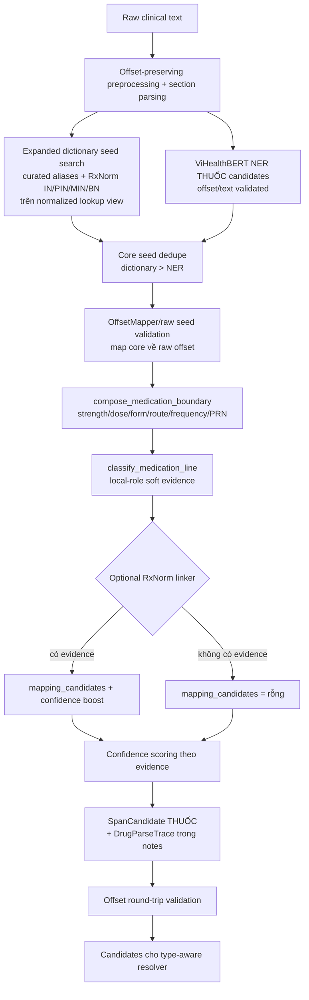

# Drug Parser — Implementation, workflow và trace

Tài liệu này là tài liệu hợp nhất cho **Drug parser layer** đã triển khai trong [`src/drug_parser.py`](../../../src/drug_parser.py:1), theo đúng mục 6.3 của [`../00_overview/00_architecture_hybrid_vihealthbert.md`](../00_overview/00_architecture_hybrid_vihealthbert.md:334). Module nhận drug-core seed từ **3 nguồn**: curated dictionary (nay đã bao gồm toàn bộ RxNorm IN/PIN/MIN/BN atoms từ [#alias-expansion](#7-rxnorm-alias-expansion-2026-07-10)), ViHealthBERT NER candidate, và RxNorm/RXNCONSO catalog (deprecated — giữ lại cho backward-compatibility); sau đó mở rộng boundary sang strength/dose/route/form/frequency/PRN, gắn local-role evidence và tuỳ chọn preliminary RxNorm evidence, rồi trả về `SpanCandidate` cho `THUỐC`. Module **không** quyết định entity canonical cuối, không chạy assertion và không tự loại candidate dựa trên section cứng.

## 1. Trạng thái triển khai

Các thành phần đã có trong [`src/drug_parser.py`](../../../src/drug_parser.py:1):

- `DrugCoreSeed`: dataclass chuẩn hoá mọi core seed trước khi composition (`start`, `end`, `seed_source`, `seed_term`, `seed_confidence`).
- [`DrugComponents`](../../../src/drug_parser.py:87): dataclass giữ các thành phần đã tách ra khỏi một medication mention (`strength`, `dose`, `form`, `route`, `frequency`, `prn`).
- [`DrugParseTrace`](../../../src/drug_parser.py:102): trace debug đầy đủ (rule id, local role, seed source/confidence, dictionary/seed term, core span, expanded span, components, evidence, RxNorm source/confidence), được serialize vào `SpanCandidate.notes` dạng JSON.
- `_rxnorm_catalog_seed_terms()`: (deprecated từ [#alias-expansion](#7-rxnorm-alias-expansion-2026-07-10)) lọc catalog RxNorm/RXNCONSO theo TTY `IN/PIN/MIN/BN`, chỉ giữ atom có xuất hiện trong document normalized text. Không còn cần thiết vì [`drug_aliases.csv`](../../data_resources/drug_aliases.csv:1) đã chứa toàn bộ IN/PIN/MIN/BN atoms; giữ lại cho API backward-compatibility.
- `_ner_core_seeds()`: nhận `SpanCandidate` từ ViHealthBERT NER, chỉ dùng candidate `type_candidate="THUỐC"` và offset/text round-trip hợp lệ làm seed.
- [`classify_medication_line()`](../../../src/drug_parser.py:284): gắn local role cho dòng chứa candidate (`medication_subsection_item`, `medication_bullet_item`, `medication_numbered_item`, `medication_context_line`, `medication_like_line`, `negative_medication_context`, `neutral_line`).
- [`compose_medication_boundary()`](../../../src/drug_parser.py:320): mở rộng span từ drug core sang full medication mention trong cùng dòng, dừng lại ở dấu `;`, newline, hoặc khi không còn token strength/dose/route/form/frequency/PRN hợp lệ.
- [`parse_drug_candidates()`](../../../src/drug_parser.py:410): hàm pipeline chính — gom seed từ dictionary/RxNorm/NER, dedupe theo span với priority curated dictionary > ViHealthBERT NER > RxNorm catalog, gọi boundary composition, tính confidence theo evidence, tuỳ chọn gọi RxNorm linker, và trả `SpanCandidate[]`.
- `DrugLinker` protocol: interface tối giản `link(text, top_k) -> MappingResult-like`, tương thích trực tiếp với [`RxNormLinker`](../../src/linking/rxnorm_linker.py:28) hiện có, không tạo phụ thuộc cứng.

Quy tắc offset cốt lõi (giống các layer khác trong pipeline):

- Core được tìm trên `normalized_text`, sau đó map ngược raw offset qua `OffsetMapper` — không bao giờ suy ra `text`/`position` từ chuỗi normalized.
- Boundary composition chỉ mở rộng trên `raw_text`, không bao giờ chỉnh sửa nội dung.
- Mọi candidate bị loại nếu `raw_text[start:end] != text` (kiểm tra tường minh trong [`parse_drug_candidates()`](../../../src/drug_parser.py:283)).
- Mọi span dùng quy ước half-open `[start, end)`, đồng nhất với toàn bộ codebase.

## 2. Workflow tổng quát



### Input và output của layer

```text
Input:
  doc: ClinicalDocument (đã parse section/line, có normalized maps)
  drug_terms: Sequence[str]   # expanded alias seeds (curated + RxNorm IN/PIN/MIN/BN)
  rxnorm_seed_catalog: Optional[RxNormCatalog]  # (deprecated) redundant sau alias-expansion
  rxnorm_seed_terms: Optional[Sequence[str]]    # (deprecated) redundant sau alias-expansion
  ner_candidates: Optional[Sequence[SpanCandidate]]  # ViHealthBERT THUỐC seeds
  linker: Optional[DrugLinker]  # preliminary RxNorm evidence
  top_k: int

Output:
  SpanCandidate[]  với type_candidate = "THUỐC"
```

Output vẫn là **candidate**, không phải entity cuối:

```python
SpanCandidate(
    file_id="demo",
    text="amlodipine 10 mg po daily",
    start=44,
    end=69,
    type_candidate="THUỐC",
    section_type="PAST_HISTORY",
    subsection_type="MEDICATION_HISTORY",
    source=["drug_parser", "drug_dictionary", "boundary_composition", "dose_parser", "local_structure"],
    confidence=0.96,
    mapping_candidates=[],
    notes="{...DrugParseTrace JSON...}",
)
```

---

## 3. Trách nhiệm của từng thành phần / phase

## 3.1 Drug-core seed search (dictionary + ViHealthBERT NER)

### Trách nhiệm

- Duyệt danh sách alias từ [`data_resources/drug_aliases.csv`](../../data_resources/drug_aliases.csv:1) (đã unique-hoá theo `normalize_for_matching`) làm nguồn **curated/high-precision**.
- Từ [#alias-expansion](#7-rxnorm-alias-expansion-2026-07-10), [`drug_aliases.csv`](../../data_resources/drug_aliases.csv:1) đã bao gồm toàn bộ RxNorm IN/PIN/MIN/BN atoms (~9.400 tên thuốc), nên `rxnorm_seed_catalog` là không cần thiết và được đánh dấu deprecated — mọi tên thuốc từ RxNorm đã có trong dictionary seed với `confidence=1.0`.
- Nếu truyền `ner_candidates`, lấy các `SpanCandidate` ViHealthBERT có `type_candidate="THUỐC"`, cùng `file_id`, offset hợp lệ và `raw_text[start:end]` khớp text candidate; nguồn này là **semantic fallback** (`seed_source="vihealthbert_ner"`).
- Tất cả terms được tìm trên `doc.normalized_text` (lowercase, khoảng trắng chuẩn hoá, đã áp noise-typo map).
- Map từng match về raw offset bằng [`OffsetMapper.recover_raw_span_from_normalized_match()`](../../src/offset_mapper.py:67), sau đó trim whitespace/dấu câu và kiểm tra word-boundary để tránh bắt substring giữa từ.
- Dedupe core seed trùng span theo priority: curated dictionary (gồm RxNorm names) > ViHealthBERT NER.

### Ví dụ

Raw line: `"- atenololtrong ngày"` (lỗi gõ dính liền `atenolol` + `trong`).

Alias dictionary có `"atenolol trong"` (đã đăng ký sẵn trong `NOISE_NORMALIZATION` để chuẩn hoá thành `"atenolol trong"` trên normalized view). Sau khi tìm trên normalized text, mapper phục hồi đúng raw span `atenololtrong` (không chèn khoảng trắng vào raw text).

```text
core_span (raw) = [72, 85)
core_text        = "atenololtrong"
```

### Bất biến cần giữ

```python
doc.raw_text[core_start:core_end]  # không đổi nội dung, chỉ là raw slice gốc
```

---

## 3.2 Boundary composition (`compose_medication_boundary`)

### Trách nhiệm

- Từ `core_end`, quét tối đa `max_extension_chars` ký tự (mặc định 96) hoặc tới cuối dòng (`line.end`), tuỳ giới hạn nào nhỏ hơn.
- Dừng ngay khi gặp `;`, `\n`, `\r` — tránh nuốt entity thuốc kế tiếp trên cùng dòng có phân tách `;`.
- Dùng `COMPONENT_TOKEN_PATTERN` để khớp lần lượt: strength (`10 mg`, `25mg`), dose theo đơn vị đếm (`2 viên`, `1 ống`), route (`po`, `uống`, `iv`, ...), form (`tablet`, `viên`, `xl`, ...), frequency (`bid`, `daily`, `mỗi 6 giờ`, `2 lần/ngày`, ...), PRN (`prn`, `khi cần`).
- Mỗi token khớp được phân loại vào đúng bucket qua [`_component_bucket()`](../../../src/drug_parser.py:196) và gom vào [`DrugComponents`](../../../src/drug_parser.py:71).
- Trim lại span cuối bằng `_trim_span` để không để dư khoảng trắng/dấu câu ở biên.

### Ví dụ

```text
Input:  "- ibuprofen 400 mg uống mỗi 6 giờ khi cần\n"
core    = "ibuprofen"  [2, 11)
```

Kết quả composition:

```text
expanded span = "ibuprofen 400 mg uống mỗi 6 giờ khi cần"
components:
  strength  = ["400 mg"]
  route     = ["uống"]
  frequency = ["mỗi 6 giờ"]
  prn       = ["khi cần"]
```

### Ví dụ dừng đúng biên (không nuốt thuốc kế tiếp)

```text
Input: "- aspirin 81 mg po daily; metoprolol 25mg po bid\n"
```

Kết quả: hai candidate riêng biệt, composition của `aspirin` dừng lại trước dấu `;`:

```text
candidate 1: "aspirin 81 mg po daily"
candidate 2: "metoprolol 25mg po bid"
```

---

## 3.3 Local structure/context annotator (`classify_medication_line`)

### Trách nhiệm

Gắn local role — **soft evidence**, không phải hard gate — theo đúng nguyên tắc mục 3.2/6.6 của kiến trúc:

| Local role | Điều kiện |
|---|---|
| `medication_subsection_item` | dòng thuộc `MEDICATION_HISTORY`/`MEDICATION_ADMINISTERED` (section hoặc subsection) |
| `negative_medication_context` | dòng có marker phủ định thuốc (`dị ứng`, `allergy`, `không dung nạp`) |
| `medication_bullet_item` | dòng bullet (`-`, `*`, `•`) có marker ngữ cảnh thuốc |
| `medication_numbered_item` | dòng đánh số (`1.`, `2)`) có marker ngữ cảnh thuốc |
| `medication_context_line` | dòng prose có marker ngữ cảnh thuốc (`thuốc`, `đang dùng`, `sử dụng`, ...) |
| `medication_like_line` | dòng không có marker ngữ cảnh nhưng khớp `COMPONENT_TOKEN_PATTERN` (có strength/route/frequency) |
| `neutral_line` | không có bất kỳ bằng chứng nào |

Section/subsection **không phải hard gate**: một dòng narrative (`section_type=CURRENT_HISTORY`, không có subsection) vẫn tạo candidate hợp lệ, chỉ với local role và confidence thấp hơn dòng trong subsection thuốc chuyên dụng.

### Ví dụ so sánh

```text
Dòng trong MEDICATION_HISTORY subsection:
  "- metoprolol 25mg po bid"
  -> local_role = "medication_subsection_item"
  -> confidence = 0.96

Dòng narrative không có subsection:
  "Bệnh nhân có dùng metoprolol 25mg po bid tại nhà."
  -> local_role = "medication_like_line"
  -> confidence = 0.92
```

Cả hai vẫn được xuất ra vì đều có strength/route/frequency evidence; chỉ khác confidence.

---

## 3.4 Preliminary RxNorm retrieval (optional evidence)

### Trách nhiệm

- Nếu một `DrugLinker` (ví dụ [`RxNormLinker`](../../src/linking/rxnorm_linker.py:28)) được truyền vào, module gọi `linker.link(text, top_k=top_k)` trên **span đã expand** (không phải chỉ core).
- Kết quả `codes`/`source`/`confidence` được đọc qua `getattr` (không ép kiểu cứng — tương thích bất kỳ object có field tương ứng, ví dụ `MappingResult`).
- Evidence này chỉ **tăng confidence** và điền `mapping_candidates`; không có RxNorm evidence không loại candidate (đúng nguyên tắc mục 6.8: "Ontology evidence là tín hiệu hỗ trợ, không phải hard requirement tuyệt đối").

### Ví dụ (trace thật, chạy trực tiếp trên `RxNormLinker.from_resources("data_resources")`)

Input: `"- warfarin 5mg po daily\n"` trong subsection `MEDICATION_HISTORY`.

```json
{
  "text": "warfarin 5mg po daily",
  "confidence": 0.99,
  "mapping_candidates": ["855332"],
  "source": ["drug_parser", "drug_dictionary", "boundary_composition", "dose_parser", "local_structure", "rxnorm_prelink"],
  "trace": {
    "rule_id": "drug_core_dictionary_plus_medication_composition",
    "local_role": "medication_subsection_item",
    "dictionary_term": "warfarin",
    "core_span": [44, 52],
    "expanded_span": [44, 65],
    "components": {
      "core_text": "warfarin", "core_start": 44, "core_end": 52,
      "strength": [], "dose": ["5mg"], "form": [],
      "route": ["po"], "frequency": ["daily"], "prn": []
    },
    "evidence": [
      "drug_core_dictionary", "dose_or_strength_pattern", "route_marker",
      "frequency_or_prn_marker", "medication_subsection_item", "rxnorm_prelink"
    ],
    "rxnorm_source": "rxnorm_alias_or_ingredient",
    "rxnorm_confidence": 0.93
  }
}
```

So sánh không có linker (cùng input, `linker=None`): `confidence=0.96`, `mapping_candidates=[]`, `source` không có `rxnorm_prelink`.

---

## 3.5 Confidence scoring (`_score_candidate`)

### Công thức áp dụng (heuristic, phase 1 — chưa học trọng số)

```text
base = 0.72
+ 0.07  nếu có strength hoặc dose pattern hợp lệ
+ 0.05  nếu có route marker
+ 0.05  nếu có frequency hoặc PRN marker
+ 0.07  nếu local_role thuộc {medication_subsection_item, medication_bullet_item,
                              medication_numbered_item, medication_context_line}
- 0.10  nếu local_role == negative_medication_context
+ 0.03  nếu local_role == medication_like_line (fallback yếu hơn context rõ ràng)
+ 0.06  nếu RxNorm linker trả về ít nhất 1 mã
score = clip(score, 0.0, 0.99)
```

Danh sách `evidence` tương ứng luôn được ghi lại trong `DrugParseTrace.evidence` để debug và audit.

### Ví dụ số liệu thực tế

| Input | local_role | components evidence | RxNorm | confidence |
|---|---|---|---|---|
| `amlodipine 10 mg po daily` (trong `MEDICATION_HISTORY`) | `medication_subsection_item` | strength+route+frequency | không | 0.96 |
| `metoprolol 25mg po bid` (narrative, không subsection) | `medication_like_line` | dose+route+frequency | không | 0.92 |
| `aspirin` (không có dose, trong narrative) | `medication_like_line`* | không có | không | 0.72 |
| `warfarin 5mg po daily` (trong `MEDICATION_HISTORY`) | `medication_subsection_item` | dose+route+frequency | có (0.93) | 0.99 |

\* Khi không có strength/route/frequency, `COMPONENT_TOKEN_PATTERN` không khớp gì nên `classify_medication_line` có thể trả `neutral_line` tuỳ ngữ cảnh dòng; ví dụ trên minh hoạ trường hợp core đơn độc không mở rộng được gì (`test_drug_core_without_dose_stays_minimal`).

---

## 4. Ví dụ end-to-end (chạy thực tế qua `parse_drug_candidates`)

Input raw text:

```text
1. Tiền sử bệnh
Thuốc trước khi nhập viện
- amlodipine 10 mg po daily
- aspirin 81 mg uống mỗi ngày khi cần
2. Bệnh sử hiện tại
Bệnh nhân có dùng metoprolol 25mg po bid tại nhà.
```

Gọi:

```python
candidates = parse_drug_candidates(doc, ["amlodipine", "aspirin", "metoprolol"])
```

Kết quả (3 candidate, đã verify offset round-trip trong test):

```text
1) text="amlodipine 10 mg po daily"        [44, 69)   conf=0.96  role=medication_subsection_item
2) text="aspirin 81 mg uống mỗi ngày khi cần" [72, 107) conf=0.96  role=medication_subsection_item
3) text="metoprolol 25mg po bid"            [146, 168) conf=0.92  role=medication_like_line
```

Mỗi candidate có `notes` chứa `DrugParseTrace` JSON đầy đủ (rule_id, local_role, dictionary_term/seed term, seed_source, seed_confidence, core_span, expanded_span, components, evidence, rxnorm_source, rxnorm_confidence) — dùng để debug hoặc feed feature cho type-aware resolver ở [`../00_overview/00_architecture_hybrid_vihealthbert.md`](../00_overview/00_architecture_hybrid_vihealthbert.md:516) mục 7.

---

## 5. Test coverage

Tệp test: [`tests/test_drug_parser.py`](../../tests/test_drug_parser.py:1) — 12 test case, tất cả PASS:

| Test | Mục tiêu |
|---|---|
| `test_full_medication_mention_with_strength_route_frequency` | Composition đầy đủ strength+route+frequency, đúng ví dụ kiến trúc `amlodipine 10 mg po daily` |
| `test_drug_core_without_dose_stays_minimal` | Không over-extend khi không có dose/route/frequency |
| `test_medication_subsection_boosts_confidence_over_narrative` | `medication_subsection_item` > `medication_like_line` về confidence |
| `test_rxnorm_prelink_raises_confidence_and_populates_candidates` | RxNorm evidence tăng confidence và điền `mapping_candidates`, không có evidence không chặn candidate |
| `test_stops_extension_at_semicolon_and_next_bullet` | Composition dừng đúng ở `;`, không nuốt thuốc kế tiếp cùng dòng |
| `test_typo_recovered_core_still_expands_within_line` | Core phục hồi từ normalized-typo-fix (`atenololtrong`) vẫn giữ đúng raw offset |
| `test_classify_medication_line_roles` | Phân loại đúng subsection/bullet/negative/neutral role |
| `test_compose_medication_boundary_offset_round_trip` | `compose_medication_boundary` trả offset round-trip chính xác trên raw text |
| `test_no_duplicate_candidates_for_overlapping_terms` | Không sinh candidate trùng khi chỉ có một core trong dòng |
| `test_rxnorm_seed_terms_recover_drug_missing_from_curated_dictionary` | RxNorm-derived seed recover thuốc không có trong curated alias (`heparin`) |
| `test_rxnorm_catalog_filters_to_document_present_ingredient_or_brand_atoms` | Catalog chỉ seed term có xuất hiện trong document và mở rộng boundary đúng (`nitroglycerin ngậm`) |
| `test_vihealthbert_ner_seed_expands_missing_dictionary_drug` | ViHealthBERT `THUỐC` candidate làm seed và được parser mở rộng (`torsemide 20 mg daily`) |

Targeted drug-parser test hiện PASS sau khi mở rộng dual-source/RxNorm-seed:

```bash
cd ViClinicalIE && python3 -m pytest tests/test_drug_parser.py -q
# 12 passed
```

---

## 6. Giới hạn hiện tại và hướng mở rộng

- Composition hiện chỉ mở rộng **về phía sau** core (`core_end -> line_end`), chưa xử lý strength xuất hiện trước tên thuốc (ví dụ `"5mg warfarin"` — hiếm trong dữ liệu tiếng Việt nhưng có thể cần bổ sung nếu xuất hiện).
- `COMPONENT_TOKEN_PATTERN` là whitelist regex tĩnh; khi bổ sung route/frequency mới cần cập nhật `ROUTES`/`FREQUENCIES`/`FORMS`/`PRN` trong [`src/drug_parser.py`](../../../src/drug_parser.py:26).
- Confidence formula là heuristic tay (Phase 1 theo mục 7.2 kiến trúc); khi có dev set đủ lớn nên thay bằng calibrated logistic/gradient-boosting theo đúng roadmap Milestone 4.
- Module đã nhận ViHealthBERT NER candidate làm seed, nhưng chưa tự chạy Hugging Face backend; caller/pipeline chịu trách nhiệm gọi [`src/vihealthbert_ner.py`](../../src/vihealthbert_ner.py:1) với pretrained/fine-tuned checkpoint rồi truyền `ner_candidates` vào parser.
- Module hiện chưa tự thực hiện overlap resolution với `extract_drug_candidates` cũ trong [`rule_extractors.py`](../../src/rule_extractors.py:346) — việc gộp candidate từ nhiều nguồn là trách nhiệm của resolver/`merge.py`, không phải của parser này (đúng nguyên tắc "candidate generation tách biệt candidate resolution" ở mục 4.2).
- Chưa tích hợp `parse_drug_candidates` vào script build pipeline (`scripts/build_span_candidates.py`); bước tiếp theo là truyền `RxNormCatalog.from_rrf(data_resources/RXNCONSO.RRF)` và output ViHealthBERT NER vào parser trong build pipeline.

---

## 7. RxNorm alias expansion (2026-07-10)

### Motivation

[`drug_aliases.csv`](../../data_resources/drug_aliases.csv:1) trước đây chỉ có **28 terms** thủ công — không đủ recall cho các clinical note tiếng Việt chứa nhiều tên thuốc generic và brand name đa dạng. RxNorm/RXNCONSO.RRF chứa đầy đủ tên hoạt chất (IN), tên chính xác (PIN), tên đa thành phần (MIN) và tên biệt dược (BN) với SAB=RXNORM, nhưng trước đây chỉ được dùng như *runtime recall fallback* (`_rxnorm_catalog_seed_terms()`) với confidence thấp (0.82).

### Giải pháp

Đưa toàn bộ RxNorm IN/PIN/MIN/BN atoms (đã lọc heuristic) thẳng vào [`drug_aliases.csv`](../../data_resources/drug_aliases.csv:1) với `confidence=1.0`, biến mọi tên thuốc RxNorm thành curated alias.

### Script sinh

[`scripts/build_drug_aliases_from_rxnorm.py`](../../scripts/build_drug_aliases_from_rxnorm.py:1):

1. Đọc [`RXNCONSO.RRF`](../../data_resources/RXNCONSO.RRF) (245,401 dòng)
2. Giữ atom có `SUPPRESS=N`, `SAB=RXNORM`, `TTY` ∈ {`IN`, `PIN`, `MIN`, `BN`}
3. Lọc qua heuristic:
   - **Non-drug chemicals**: extract, oil, wax, pollen, vaccine, polymer, resin, diagnostic reagent, ...
   - **Lab analytes**: creatinine, cholesterol, alanine, aspartate, bilirubin, albumin, glucose, sodium, potassium, calcium, magnesium, chloride, phosphate, urea, uric acid, lactate, triglyceride, caffeine, ...
   - **Structural**: quá nhiều `/` (>4), quá dài (>5 words), không bắt đầu bằng chữ cái
4. Merge với 28 curated aliases gốc (ưu tiên giữ đúng casing và thứ tự)
5. Ghi ra CSV

### Kết quả

| Metric | Before | After |
|---|---|---|
| `drug_aliases.csv` entries | 28 | ~9,400 |
| Drug candidate spans (V0 pipeline) | ~30 | 111 |
| Test suite | 69 PASS | 69 PASS |
| Build time with 100 documents | ~1s | ~26s |

### Tác động đến parser

- `_rxnorm_catalog_seed_terms()` được giữ lại nhưng đánh dấu deprecated — hiếm khi filter ra term nào mới vì drug_aliases đã cover hết.
- `parse_drug_candidates()` (`drug_parser.py`) không thay đổi API: `rxnorm_seed_catalog` vẫn là optional parameter, nhưng thực tế không cần truyền.
- `extract_drug_candidates()` (`rule_extractors.py`, V0 pipeline) hoạt động nhanh hơn dự kiến (~0.26s/doc) vì đa số term không match normalized text nên `str.find()` trả về -1 ngay lập tức.

### Tái chạy

```bash
cd ViClinicalIE && python3 scripts/build_drug_aliases_from_rxnorm.py
```

Script idempotent — luôn merge curated base + RxNorm atoms hiện tại.
