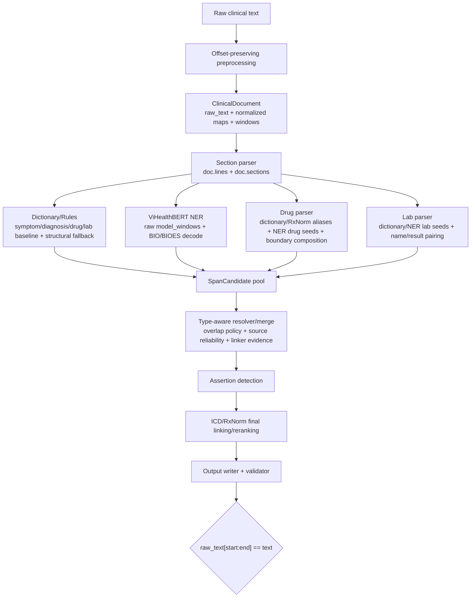

# Dictionary/Rules — Updated architecture note after preprocessing, NER, drug parser, lab parser and lab-seed plan

Tài liệu này cập nhật vai trò của **Dictionary/Rules layer** sau các thay đổi đã được ghi nhận trong:

- [`1_offset_preserving_preprocessing_implementation.md`](../01_pipeline/01_offset_preserving_preprocessing.md)
- [`2_vihealthbert_ner.md`](../02_models/01_vihealthbert_ner.md)
- [`3_drug_parser.md`](./01_drug_parser.md)
- [`4_lab_parser.md`](./02_lab_parser.md)
- [`1_plan_update_lab_seeds.md`](1_plan_update_lab_seeds.md)

Nội dung dưới đây **không đọc lại codebase**; nó đồng bộ tài liệu Dictionary/Rules theo các implementation log và plan đã có.

---

## 1. Vai trò hiện tại của Dictionary/Rules layer

Dictionary/Rules không còn nên được hiểu là module duy nhất xử lý thuốc/xét nghiệm. Vai trò đúng hiện tại là:

```text
curated dictionary exact match
+ normalized lookup evidence
+ local section/context evidence
+ guarded structural fallback
→ SpanCandidate có raw offset, source, confidence, trace/context metadata
→ type-aware resolver quyết định entity cuối cùng
```

Layer này vẫn sinh candidate cho năm type:

```text
TRIỆU_CHỨNG
CHẨN_ĐOÁN
THUỐC
TÊN_XÉT_NGHIỆM
KẾT_QUẢ_XÉT_NGHIỆM
```

Nhưng sau khi đã có `ViHealthBERTNER`, `drug_parser` và `lab_parser`, Dictionary/Rules phải được xem là:

1. **Precision anchor** cho symptom/diagnosis và các alias curated.
2. **Evidence provider** cho resolver khi overlap với NER/parser.
3. **Ablation/fallback baseline** cho drug/lab, không phải parser chính.
4. **Guarded structural fallback** với confidence thấp, không phải hard-output source.

Không được diễn giải layer này theo precedence cứng kiểu:

```text
rules > dictionary > NER > parser
```

Thay vào đó, mọi source là feature để resolver/type-aware merge scoring sử dụng.

---

## 2. Offset contract đã cập nhật theo preprocessing layer

Dictionary/Rules phụ thuộc trực tiếp vào offset-preserving preprocessing. `ClinicalDocument` hiện có nhiều view song song:

```text
raw_text
normalized_text / normalized_lookup_text
norm_to_raw_map
raw_to_norm_map
line_windows
sentence_windows
model_windows
token_offsets
doc.lines / doc.sections sau section parsing
```

Bất biến bắt buộc cho mọi candidate:

```python
candidate.text == doc.raw_text[candidate.start:candidate.end]
```

Quy ước offset là half-open:

```text
[start, end)
```

### 2.1 Normalized lookup chỉ dùng để tìm kiếm

Dictionary matching có thể chạy trên `doc.normalized_text`, vì normalized view đã hỗ trợ:

- Unicode NFC.
- Lowercase cho matching.
- Typo/noise replacement.
- Collapse/trim whitespace.
- Mapping hai chiều về raw text.

Nhưng output entity/candidate **luôn** phải lấy từ raw:

```text
normalized match → OffsetMapper.recover_raw_span_from_normalized_match → raw span → candidate.text = raw_text[start:end]
```

Ví dụ đúng:

```text
Raw:        "  cảm giác  khó chịu; atenololtrong ngày  "
Normalized: "cảm giác khó chịu; atenolol trong ngày"
Lookup:     "atenolol trong"
Raw span:   "atenololtrong"
Output:     text="atenololtrong", position=[raw_start, raw_end)
```

Ví dụ sai:

```text
Output text="atenolol trong"  # normalized string không xuất hiện nguyên văn tại raw span
```

### 2.2 Dictionary/rule phải dùng raw coordinates giống NER/parser

Các module mới đều dùng cùng contract:

| Module | Nơi match/infer | Cách ra offset cuối |
|---|---|---|
| Dictionary/Rules | normalized lookup hoặc raw regex | recover/map về raw, rồi lấy raw slice |
| ViHealthBERT NER | raw `model_windows` | local token offset + `window.start` |
| Drug parser | normalized seed + raw boundary composition | core map về raw, expansion trên raw line |
| Lab parser | normalized seed + raw result pairing | seed map về raw, name/result detect trên raw line |

Vì vậy Dictionary/Rules không được tự dùng normalized/canonical alias làm `text` hay `position`.

---

## 3. Workflow tổng quát đã cập nhật



Dictionary/Rules hiện là một branch trong candidate pool, không phải branch quyết định cuối.

---

## 4. Resource status sau các cập nhật

## 4.1 Symptom và diagnosis seeds

Giữ vai trò hiện tại:

```text
symptom_seed_terms.csv    → TRIỆU_CHỨNG
 diagnosis_seed_terms.csv → CHẨN_ĐOÁN
```

Các seed này vẫn là precision-oriented dictionary evidence, cần phối hợp với:

- section/subsection/local cue;
- ViHealthBERT semantic span;
- resolver khi overlap symptom/diagnosis;
- ICD preliminary evidence ở linking/resolver stage.

## 4.2 Drug aliases đã mở rộng mạnh bằng RxNorm

`drug_aliases.csv` không còn là list nhỏ ~28 alias thủ công. Theo drug parser log, resource này đã được mở rộng bằng RxNorm/RXNCONSO atoms:

```text
TTY ∈ {IN, PIN, MIN, BN}
SAB = RXNORM
SUPPRESS = N
```

Sau lọc heuristic, `drug_aliases.csv` chứa khoảng **9.400 tên thuốc/alias** và được dùng như curated/high-precision seed cho drug parser.

Hệ quả với Dictionary/Rules:

- `extract_drug_candidates()` trong rule extractor vẫn có thể dùng `drug_aliases.csv` làm baseline.
- Nhưng do coverage drug alias đã lớn, rule baseline cần cẩn thận false positive và overlap.
- Drug parser mới là nguồn chính cho `THUỐC`, vì có:
  - `DrugCoreSeed`;
  - dedupe dictionary > NER;
  - boundary composition strength/dose/form/route/frequency/PRN;
  - local-role scoring;
  - optional RxNorm prelink;
  - `DrugParseTrace` trong notes.

## 4.3 Lab seeds hiện tại và kế hoạch thay thế bằng metadata-backed dictionary

`lab_seed_terms.csv` hiện vẫn là flat curated list nhỏ. Theo lab parser log, đã bổ sung thêm:

```text
bạch cầu
kali
cea
huyết khối
k
```

Lab parser hiện dùng `lab_seed_terms.csv` cùng ViHealthBERT NER seed để tạo `LabSeed`, expand parenthetical alias và pair result.

Tuy nhiên kế hoạch mới trong `1_plan_update_lab_seeds.md` là thay flat list bằng resource có metadata:

```text
combined_lab_catalog.csv       # merged từ lab_list.pdf + lab_med_ministry.pdf
lab_terms_curated.csv          # alias-level matching resource
lab_canonical_map.csv          # canonical grouping
```

Resource mới cần lưu:

```csv
term,canonical_key,canonical_name,source,source_detail,category,specimen,requires_context,priority,notes
```

Hệ quả với Dictionary/Rules:

- Lab dictionary baseline trong rule extractor chỉ nên là backward-compatible/simple baseline.
- Lab parser là nguồn chính cho lab vì có name/result pairing và trace.
- Khi lab dictionary mở rộng bằng PDF + abbreviation aliases, rule extractor cần tránh match short aliases toàn cục như `k`, `cr`, `ck`, `pt`, `Na`, `Ca` nếu chưa có context gate.

## 4.4 Mapping aliases

`mapping_aliases.csv` vẫn là alias/canonical evidence cho linker, ví dụ:

```csv
cao huyết áp,tăng huyết áp,icd,common alias
tylenol,acetaminophen,rxnorm,brand alias
coumadin,warfarin,rxnorm,brand alias
```

Không được dùng canonical alias để thay `candidate.text`; canonical chỉ là metadata/linker evidence.

---

## 5. Rule families và reliability tiers cập nhật

| Tier | Source hiện tại | Reliability | Vai trò sau cập nhật |
|---|---|---:|---|
| `exact_curated_alias` | symptom/diagnosis/drug/lab dictionary exact normalized match | Cao | Precision anchor, nhưng vẫn cần resolver khi overlap. |
| `specialized_parser` | `drug_parser`, `lab_parser` | Cao | Nguồn chính cho thuốc và xét nghiệm có cấu trúc. |
| `semantic_ner` | `vihealthbert_ner` | Vừa-cao, tùy type/threshold | Semantic span proposal, đặc biệt symptom/diagnosis. |
| `structured_pattern` | drug/lab regex baseline, value/dose patterns | Cao-vừa | Evidence cho boundary/result, không tự quyết định entity cuối. |
| `contextual_dictionary_match` | dictionary + section/subsection/local cue | Vừa-cao | Boost confidence, hỗ trợ resolver. |
| `substring_match` | containment normalized trong line | Vừa-thấp | Chỉ an toàn với term đặc hiệu + boundary. |
| `structural_fallback` | bullet/key-value allowlist | Thấp | Last resort, confidence thấp, cần resolver xác nhận. |

Khuyến nghị: thêm `reliability_tier` hoặc `rule_id` vào `SpanCandidate.notes` để resolver và error analysis phân biệt rõ các tier trên.

---

## 6. Quan hệ với ViHealthBERT NER

ViHealthBERT NER đã có layer riêng:

- Input là raw `model_windows`, không phải normalized text.
- Decode BIO/BIOES thành `SpanCandidate`.
- Raw offset = `window.start + local_offset`.
- Có threshold theo entity type.
- Deduplicate exact span/type giữa overlapping windows.
- Không làm assertion/linking/canonical decision.

Dictionary/Rules bổ sung cho NER theo ba hướng:

1. **Xác nhận span NER** khi overlap exact/near-exact với curated dictionary.
2. **Tăng recall** cho term phổ biến mà model bỏ sót.
3. **Cung cấp feature**: source, section, local cue, dictionary term, reliability tier.

Chính sách quan trọng:

- NER là semantic extractor chính cho `TRIỆU_CHỨNG` và `CHẨN_ĐOÁN`.
- Dictionary không được hard override NER nếu NER có boundary tốt hơn.
- Với thuốc/lab, NER candidate có thể làm seed cho parser chuyên biệt thay vì output trực tiếp.

Ví dụ drug flow:

```text
ViHealthBERT predicts "torsemide" as THUỐC
→ drug_parser dùng NER seed
→ expands to "torsemide 20 mg daily"
→ resolver ưu tiên parser boundary hơn raw NER core nếu evidence tốt hơn
```

Ví dụ lab flow:

```text
ViHealthBERT predicts lab name in narrative
→ lab_parser dùng NER TÊN_XÉT_NGHIỆM seed
→ pair result nearby
→ output name/result candidates with LabParseTrace
```

---

## 7. Quan hệ với Drug parser

Drug parser hiện là layer chính cho `THUỐC`.

### 7.1 Drug parser đã làm gì hơn baseline rule

Drug parser nhận seed từ:

```text
1. drug_aliases.csv curated dictionary, nay bao gồm RxNorm IN/PIN/MIN/BN atoms
2. ViHealthBERT NER THUỐC candidates
3. RxNorm catalog seed fallback deprecated/backward-compatible
```

Sau đó:

- dedupe seed theo priority dictionary > NER > deprecated catalog;
- map core từ normalized lookup về raw offset;
- compose medication boundary trên raw line;
- nhận diện strength/dose/form/route/frequency/PRN;
- dừng ở `;`, newline hoặc khi hết component hợp lệ;
- classify local medication role;
- optional RxNorm prelink để tăng confidence và điền `mapping_candidates`;
- ghi `DrugParseTrace` JSON vào notes.

### 7.2 Vai trò còn lại của Dictionary/Rules drug baseline

`extract_drug_candidates()` trong rule extractor chỉ nên được mô tả là:

- baseline/ablation rule-only;
- fallback hoặc evidence bổ sung;
- hồi quy đơn giản cho drug dictionary + dose trail;
- không cạnh tranh cứng với `parse_drug_candidates()`.

Nếu cả hai cùng tạo candidate overlap:

```text
rule_extractors: "aspirin 81 mg po daily" source=[drug_dictionary, drug_regex]
drug_parser:     "aspirin 81 mg po daily" source=[drug_parser, drug_dictionary, boundary_composition, dose_parser, local_structure]
```

Resolver nên ưu tiên candidate có trace/parser evidence đầy đủ hơn, hoặc merge source vào một candidate hợp nhất.

### 7.3 Drug confidence policy

Drug parser confidence hiện dựa trên heuristic:

```text
base 0.72
+ strength/dose
+ route
+ frequency/PRN
+ medication local role
- negative medication context
+ RxNorm prelink
clip <= 0.99
```

Dictionary/Rules baseline không nên dùng score cao hơn parser khi parser có boundary/local-role/RxNorm evidence rõ ràng.

---

## 8. Quan hệ với Lab parser

Lab parser hiện là layer chính cho:

```text
TÊN_XÉT_NGHIỆM
KẾT_QUẢ_XÉT_NGHIỆM
```

### 8.1 Lab parser đã làm gì hơn baseline rule

Lab parser nhận seed từ:

```text
1. lab_seed_terms.csv dictionary
2. ViHealthBERT NER TÊN_XÉT_NGHIỆM candidates
```

Sau đó:

- dedupe seed theo priority `lab_dictionary > vihealthbert_ner`;
- map seed normalized về raw span;
- expand name sang parenthetical alias:

```text
cea → cea (kháng nguyên ung thư phôi)
hct → hct (hematocrit)
k   → k (kali)
```

- tìm result ngay sau name, giới hạn bởi next seed hoặc line end;
- hỗ trợ result numeric/range/trend/qualitative:

```text
14,43
537 mg/dl
2.0 -> 3.2
tăng từ 2.0 lên 3.2
âm tính x1
bình thường
```

- xử lý multiple pairs trên cùng dòng bằng `next_seed_start`;
- classify local lab role;
- ghi `LabParseTrace` JSON vào notes.

### 8.2 Vai trò còn lại của Dictionary/Rules lab baseline

`extract_lab_candidates()` trong rule extractor chỉ nên được mô tả là:

- baseline đơn giản cho `name: value` hoặc `name value` gần kề;
- evidence bổ sung hoặc test coverage ban đầu;
- không phải nguồn chính cho table-like rows, parenthetical expansion, trend/range, qualitative hoặc multiple pairs.

Ví dụ overlap:

```text
rule_extractors: WBC + 14,43 bằng VALUE_PATTERN
lab_parser:      WBC + 14,43 bằng LabPair + LabParseTrace + local-role scoring
```

Resolver nên merge hoặc ưu tiên lab parser trace.

### 8.3 Lab dictionary expansion plan ảnh hưởng Dictionary/Rules

Kế hoạch lab seed mới yêu cầu:

1. Combine `lab_list.pdf` và `lab_med_ministry.pdf` thành `combined_lab_catalog.csv`.
2. Extract PDF-derived aliases trước.
3. Sau đó dùng `abbreviation.txt` chỉ như supplemental alias source.
4. Curate thành:

```text
lab_terms_curated.csv
lab_canonical_map.csv
```

5. Parser dùng metadata-backed `LabTermEntry` thay vì bare strings.

Dictionary/Rules cần cập nhật tư duy resource:

- Không dump toàn bộ PDF/abbreviation vào flat rule dictionary.
- Không match globally các short/ambiguous aliases nếu chưa có context gate.
- Các alias như `K/k`, `Ca`, `Cl`, `Mg`, `Na`, `PT`, `pH`, `cr`, `ck`, `Hb`, `Hct` cần `requires_context=true` trong resource mới.

Context-required alias chỉ nên accept khi có một trong các tín hiệu:

```text
lab section/subsection gần đó
line cue: xét nghiệm, cận lâm sàng, kết quả, điện giải, khí máu, chem, cbc, đông máu, huyết học
result ngay sau alias: K 5.4, Na: 138, Ca là 12.0, pH 7.32
parenthetical expansion: cr (creatinine), k (kali)
```

---

## 9. Chi tiết extractor theo type — trạng thái cập nhật

## 9.1 TRIỆU_CHỨNG

Nguồn Dictionary/Rules:

```text
symptom_seed_terms.csv
+ current-history/admission/symptom section cues
+ structural fallback thấp nếu line role phù hợp
```

Vai trò sau NER:

- Dictionary là precision anchor.
- ViHealthBERT là semantic proposal chính.
- Resolver cần xử lý overlap và boundary.
- Assertion layer xử lý phủ định/uncertainty, không đưa `không`, `phủ nhận` vào span symptom.

Ví dụ:

```text
Lý do nhập viện: đau ngực, khó thở
```

Expected candidates:

```text
đau ngực → TRIỆU_CHỨNG, source includes symptom_dictionary/context
khó thở  → TRIỆU_CHỨNG, source includes symptom_dictionary/context
```

## 9.2 CHẨN_ĐOÁN

Nguồn Dictionary/Rules:

```text
diagnosis_seed_terms.csv
+ chronic disease / diagnostic findings / past history / hospital assessment cues
```

Vai trò sau NER/linking:

- Dictionary giúp xác nhận clinical diagnosis phổ biến.
- ViHealthBERT đề xuất semantic span dài/ngữ cảnh rộng hơn.
- ICD preliminary evidence ở resolver/linker nên hỗ trợ phân biệt symptom vs diagnosis.

Ví dụ:

```text
Tiền sử: tăng huyết áp, đái tháo đường type 2
```

Dictionary baseline có thể bắt:

```text
tăng huyết áp
đái tháo đường
```

Boundary dài `đái tháo đường type 2` nên để NER/resolver/ICD evidence xử lý.

## 9.3 THUỐC

Baseline Dictionary/Rules:

```text
drug_aliases.csv
+ DOSE_TRAIL_PATTERN
+ medication context evidence
```

Nhưng source chính hiện là `drug_parser`.

Rule baseline có thể tạo:

```text
aspirin 81 mg po daily → THUỐC
```

Drug parser có thể tạo cùng span nhưng thêm:

```text
source=[drug_parser, drug_dictionary, boundary_composition, dose_parser, local_structure, optional rxnorm_prelink]
notes={DrugParseTrace...}
```

Resolver nên ưu tiên/merge parser evidence.

## 9.4 TÊN_XÉT_NGHIỆM và KẾT_QUẢ_XÉT_NGHIỆM

Baseline Dictionary/Rules:

```text
lab_seed_terms.csv
+ VALUE_PATTERN
+ lab section/cue context
```

Nhưng source chính hiện là `lab_parser`.

Lab parser hỗ trợ tốt hơn:

- parenthetical expansion;
- multiple pairs on same line;
- numeric/range/trend/qualitative result;
- comma decimal;
- unit extraction;
- name without result;
- NER seed fallback;
- local-role scoring;
- `LabParseTrace`.

Rule baseline vẫn hữu ích cho ablation/simple regression nhưng không nên quyết boundary cuối.

---

## 10. Structural fallback — giữ nhưng phải giảm quyền lực

Structural fallback vẫn cần cho recall khi dictionary/NER/parser bỏ sót. Tuy nhiên đây là tier thấp nhất.

### 10.1 Allowlist hiện tại

Bullet/key-value fallback có thể sinh:

| Context | Entity type |
|---|---|
| `CHRONIC_DISEASES` | `CHẨN_ĐOÁN` |
| `CURRENT_SYMPTOMS` | `TRIỆU_CHỨNG` |
| `DIAGNOSTIC_FINDINGS` | `CHẨN_ĐOÁN` |
| `LAB_RESULT_SECTION` | `TÊN_XÉT_NGHIỆM` |
| `IMAGING_RESULT_SECTION` | `TÊN_XÉT_NGHIỆM` |
| `ADMISSION_REASON` | `TRIỆU_CHỨNG` |
| `MEDICATION_HISTORY` / `MEDICATION_ADMINISTERED` | `THUỐC` for key-value fallback |

### 10.2 Guardrails bắt buộc

- `STRUCTURAL_CONFIDENCE = 0.40`.
- Chặn non-target normalized text.
- Chặn bullet bắt đầu bằng event/action verb:

```text
được
bắt đầu
lên lịch
đã
gọi
đến
sau đó
```

- Giới hạn value dài bằng `STRUCTURAL_MAX_VALUE_WORDS = 12`.
- Không dùng fallback để output hàng loạt administrative/action lines.

### 10.3 Chính sách sau khi có parser chuyên biệt

Nếu structural fallback tạo `THUỐC` hoặc lab candidate overlap với drug/lab parser, resolver gần như luôn nên ưu tiên parser evidence.

Fallback chỉ nên survive khi:

- không có candidate tốt hơn;
- context rất rõ;
- không vi phạm non-target/event guards;
- span pass offset invariant.

---

## 11. Confidence/source policy cập nhật

| Source/candidate | Confidence khái niệm | Policy |
|---|---:|---|
| Drug parser full composition + local role + optional RxNorm | `~0.90–0.99` | Nguồn chính cho `THUỐC`. |
| Lab parser paired name/result + local role | `~0.85–0.95` | Nguồn chính cho lab. |
| ViHealthBERT NER high-confidence symptom/diagnosis | threshold theo type | Semantic source chính cho symptom/diagnosis. |
| Dictionary exact curated alias + context | `~0.80–0.90` | Precision anchor / resolver feature. |
| Dictionary exact curated alias không context mạnh | `~0.60–0.75` | Candidate cần resolver threshold. |
| Rule regex baseline drug/lab | `~0.80+` nếu có structure | Useful baseline, nhưng parser trace mạnh hơn. |
| Structural fallback | `0.40` | Last resort. |

Resolver nên dùng các feature:

```text
source
confidence
reliability_tier / rule_id
entity_type
section_type
subsection_type
local_role
left_context/right_context
line_text
span length
parser trace components/result kind
NER confidence/model_window
ontology/linker score
exact/near overlap across sources
requires_context flag for dictionary alias
```

---

## 12. Notes/trace khuyến nghị

Các parser chuyên biệt đã serialize trace vào `SpanCandidate.notes`:

```text
DrugParseTrace
LabParseTrace
```

Dictionary/Rules nên tiến tới ghi trace tương tự, tối thiểu:

```json
{
  "rule_id": "diagnosis_dictionary_context_match",
  "reliability_tier": "contextual_dictionary_match",
  "dictionary_term": "tăng huyết áp",
  "normalized_span": [10, 22],
  "raw_span": [12, 24],
  "context_role": "CHRONIC_DISEASES",
  "evidence": ["diagnosis_dictionary", "diagnosis_context"]
}
```

Với lab dictionary mới, trace nên thêm:

```json
{
  "canonical_key": "creatinine",
  "canonical_name": "Creatinin",
  "source_detail": "lab_med_ministry item 51; lab_list item 2",
  "category": "chemistry",
  "specimen": "blood",
  "requires_context": true
}
```

---

## 13. Test coverage cần phản ánh trạng thái mới

### 13.1 Rule extractor tests hiện có

Giữ các nhóm test:

- diagnosis từ chronic disease section;
- drug span có dose và typo/alias recovery;
- lab name/result offsets;
- non-target rejected nhưng finding hợp lệ vẫn extract;
- structural bullet harvest tách concept sạch;
- current-history structural fallback;
- imaging bullet và event verb guard.

### 13.2 Tests liên quan preprocessing cần được xem là dependency contract

Dictionary/Rules cần tương thích với preprocessing tests:

- raw/normalized parallel views;
- whitespace collapse recover;
- typo expansion `atenololtrong -> atenolol trong`;
- Unicode decomposed mapping;
- CRLF/LF/dòng rỗng;
- token/window offset round-trip.

### 13.3 Tests liên quan NER/parser cần được nhắc trong integration plan

Khi kết nối candidate pool, cần có test overlap/merge:

1. NER symptom vs dictionary symptom same span.
2. NER diagnosis longer boundary vs dictionary shorter diagnosis.
3. Rule drug baseline vs drug parser same span.
4. Rule lab baseline vs lab parser paired output.
5. NER drug seed expanded by drug parser.
6. NER lab seed paired by lab parser.
7. Structural fallback bị loại khi parser/NER tốt hơn.

### 13.4 Tests bắt buộc cho lab dictionary upgrade

Từ lab-seed plan, cần thêm:

- load `lab_terms_curated.csv` thành `LabTermEntry`;
- alias → canonical_key;
- context-gated aliases:

```text
k 5.4 in lab context      → accepted
k in ordinary prose       → rejected
cr (creatinine) 1.2       → accepted
pt without lab context    → rejected
```

- overlap alias resolution:

```text
bilirubin toàn phần > bilirubin
canxi ion hóa > canxi
CRP hs > CRP
Troponin T hs > Troponin T
```

- unit recognition without unit-as-lab-name;
- offset round-trip for every emitted candidate.

---

## 14. Giới hạn hiện tại đã cập nhật

- Dictionary/Rules vẫn là baseline; drug/lab parsing đã chuyển sang parser chuyên biệt.
- Drug dictionary rất lớn sau RxNorm alias expansion; cần resolver/overlap handling tốt để tránh over-generation.
- Lab dictionary hiện vẫn flat và coverage nhỏ; kế hoạch metadata-backed dictionary chưa phải implemented status nếu chưa có `lab_terms_curated.csv`/`lab_canonical_map.csv`.
- Short lab aliases (`k`, `cr`, `ck`, `pt`, `Na`, `Ca`, ...) nguy hiểm nếu rule extractor match toàn cục không context gate.
- Confidence vẫn heuristic, chưa calibrated trên dev set.
- Structural fallback precision thấp; cần error analysis và active learning nếu dùng nhiều.
- Dictionary/Rules chưa có trace JSON đầy đủ như drug/lab parser.
- ViHealthBERT layer hiện là candidate generator; checkpoint/fine-tuning/integration pipeline có thể vẫn tùy môi trường.

---

## 15. Khuyến nghị phát triển tiếp

## 15.1 Ngắn hạn

1. Ghi rõ trong pipeline docs: `drug_parser` và `lab_parser` là primary cho thuốc/lab; rule extractor là baseline/evidence.
2. Thêm `rule_id` và `reliability_tier` vào `SpanCandidate.notes` của Dictionary/Rules.
3. Khi merge candidate, nếu rule baseline và parser cùng span/type thì merge source thay vì output duplicate.
4. Với drug aliases lớn, kiểm tra false positives theo source `drug_dictionary` baseline.
5. Với lab, không mở rộng flat CSV bừa bãi bằng PDF/abbreviation raw; đi theo plan `combined_lab_catalog → lab_terms_curated → lab_canonical_map`.
6. Thêm context gate cho short lab aliases trước khi đưa vào dictionary rộng.
7. Thêm integration tests cho NER seed → parser expansion/pairing.

## 15.2 Trung hạn

1. Chuẩn hóa dictionary loader dùng chung:

```text
term
canonical_key/canonical_name
entity_type
source/source_detail
priority
requires_context
reliability
notes
```

2. Cho resolver đọc metadata dictionary thay vì chỉ đọc `source` string.
3. Kết nối preliminary ICD/RxNorm evidence vào resolver như feature, không hard requirement.
4. Tune threshold/confidence theo type và source trên dev set.
5. Per-rule precision report:

```text
rule_id,type,precision,recall_contribution,fp_examples,fn_examples
```

## 15.3 Dài hạn

- Learned resolver dùng features từ NER/parser/rules/linker.
- Active learning cho false positives của structural fallback và short aliases.
- Human-reviewed resource expansion pipeline cho lab/drug dictionaries.
- Versioned resource artifacts để trace được candidate sinh từ resource version nào.

---

## 16. Acceptance criteria cập nhật

Một phiên bản Dictionary/Rules đạt yêu cầu sau các module mới khi:

- 100% candidate pass:

```python
raw_text[start:end] == candidate.text
```

- Dictionary exact match không bắt term nằm giữa token lớn hơn.
- Normalized lookup không bao giờ được dùng làm output text.
- Rule extractor không cạnh tranh cứng với `drug_parser`/`lab_parser`.
- Drug/lab overlap được merge/resolved bằng parser evidence và trace.
- ViHealthBERT candidates có thể được xác nhận bởi dictionary hoặc dùng làm seed cho parser.
- Structural fallback luôn confidence thấp và có guardrails.
- Short/ambiguous lab aliases chỉ được match khi có context/result/parenthetical evidence.
- Resolver có đủ metadata để phân biệt:

```text
exact curated alias
contextual dictionary match
specialized parser candidate
semantic NER candidate
structured regex baseline
structural fallback
```

- Có positive/negative/offset tests cho mỗi rule family và mỗi resource expansion lớn.

---

## 17. Kết luận

Sau các implementation log mới, Dictionary/Rules cần được cập nhật từ mô hình “rule extractor trung tâm” sang mô hình **candidate/evidence provider** trong pipeline hybrid:

```text
Offset-preserving preprocessing
→ raw/normalized/window views an toàn offset
→ Dictionary/Rules + ViHealthBERT NER + Drug parser + Lab parser
→ candidate pool có trace/source/confidence
→ type-aware resolver
→ assertion/linking/output validation
```

Thiết kế an toàn nhất là:

- giữ raw offset invariant tuyệt đối;
- dùng dictionary như curated evidence, không hard override;
- để drug/lab parser quyết boundary cấu trúc chính;
- để ViHealthBERT cung cấp semantic hypotheses;
- để resolver kết hợp source reliability, parser trace, NER confidence, local context và ontology/linker evidence;
- phát triển lab dictionary mới theo pipeline có canonical metadata và context-gated ambiguous aliases.
---

## 18. Implementation Log — 2026-07-11

### 18.1 Tổng quan

Module Dictionary/Rules và Resolver đã được triển khai theo mô tả kiến trúc trong tài liệu này.
Các thay đổi chính gồm ba phần:

1. **Trace metadata** — mọi `SpanCandidate` từ rule extractor giờ có `rule_id` và `reliability_tier` trong `notes`.
2. **Source-aware merge/resolver** — thay precedence cứng bằng rank theo source tag và reliability tier, merge exact duplicates thay vì discard.
3. **Integration tests** — 14 trace metadata tests trong `test_rule_extractors.py` và 12 merge/resolver tests trong file mới `test_merge.py`.

### 18.2 Trace metadata trong rule extractors

Mỗi hàm extractor và `make_structural_candidate()` hiện serialize trace JSON vào `SpanCandidate.notes`,
cho phép resolver phân biệt rõ reliability tier của từng candidate.

| Extractor | `rule_id` | `reliability_tier` | Các field khác |
|---|---|---|---|
| `extract_diagnosis_candidates()` | `diagnosis_dictionary_context_match` | `contextual_dictionary_match` | `dictionary_term`, `raw_span`, `context_role`, `evidence` |
| `extract_symptom_candidates()` | `symptom_dictionary_context_match` | `contextual_dictionary_match` hoặc `exact_curated_alias` | `dictionary_term`, `raw_span`, `evidence` |
| `extract_drug_candidates()` | `drug_dictionary_baseline` | `contextual_dictionary_match` | `dictionary_term`, `raw_span`, `evidence` |
| `extract_lab_candidates()` | `lab_dictionary_baseline` | `contextual_dictionary_match` | `dictionary_term`, `raw_span`, `evidence` |
| `make_structural_candidate()` | `structural_bullet_harvest` hoặc `structural_key_value_harvest` | `structural_fallback` | `context_role`, `full_line` |

Evidence list theo từng loại:

- **Diagnosis**: `["diagnosis_dictionary", "section_rule", "diagnosis_context"]`
- **Symptom có context**: `["symptom_dictionary", "symptom_context"]`
- **Symptom không context mạnh**: `["symptom_dictionary"]`
- **Drug**: `["drug_dictionary", "medication_context"]` hoặc `["drug_dictionary"]`
- **Lab**: `["lab_dictionary", "lab_context"]`

Cấu trúc trace cho diagnosis (ví dụ):

```json
{
  "rule_id": "diagnosis_dictionary_context_match",
  "reliability_tier": "contextual_dictionary_match",
  "dictionary_term": "tăng huyết áp",
  "raw_span": [12, 24],
  "context_role": "CHRONIC_DISEASES",
  "evidence": ["diagnosis_dictionary", "section_rule", "diagnosis_context"]
}
```
### 18.3 Source-aware merge/resolver

Module `src/merge.py` đã được viết lại để thay precedence cứng bằng hệ thống rank theo source reliability.

#### 18.3.1 Bảng rank nguồn (`SOURCE_RELIABILITY_RANK`)

Mỗi source tag có rank số (càng thấp = càng tin cậy):

| Rank | Source tag |
|---|---:|
| 1 | `drug_parser`, `lab_parser` |
| 2 | `boundary_composition`, `dose_parser`, `local_structure` |
| 3 | `rxnorm_prelink` |
| 4 | `vihealthbert_ner` |
| 5 | `lab_dictionary`, `drug_dictionary`, `diagnosis_dictionary`, `symptom_dictionary` |
| 6 | `section_rule` |
| 7 | `lab_regex` |
| 8 | `non_target_dictionary` |
| 9 | `rxnorm_catalog` |
| 20 | `structural_fallback` |

NER được xếp hạng **trên** dictionary cho symptom/diagnosis (rank 4 vs 5), phù hợp với Section 6 của plan ("NER là semantic extractor chính cho TRIỆU_CHỨNG và CHẨN_ĐOÁN").

#### 18.3.2 Bảng rank reliability tier (`RELIABILITY_TIER_RANK`)

Nếu candidate có `reliability_tier` trong trace notes, rank từ tier này **ghi đè** rank từ source tag:

| Rank | Tier |
|---|---:|
| 1 | `specialized_parser` |
| 2 | `semantic_ner` |
| 3 | `contextual_dictionary_match` |
| 4 | `exact_curated_alias` |
| 5 | `structured_pattern` |
| 6 | `substring_match` |
| 20 | `structural_fallback` |

#### 18.3.3 Hàm `_source_rank(candidate)`

Tổng hợp rank từ cả hai nguồn:

- Ưu tiên `reliability_tier` từ trace (nếu có).
- Fallback về rank thấp nhất từ `source` tags.
- Penalty +3 cho `structural_fallback` nếu là source tag.
- Fallback rank 15 nếu không có source.

#### 18.3.4 Hàm `_merge_sources(keep, other)`

Khi hai candidate cùng exact span/type:

- Merge source tags (deduplicate, giữ thứ tự).
- Giữ trace từ candidate có rank tốt hơn.
- Confidence = `max(keep.confidence, other.confidence)` nếu other có rank tốt hơn,
  ngược lại giữ `keep.confidence`.

#### 18.3.5 Hàm `merge_candidates(candidates)`

Pipeline merge:

1. Lọc candidate có `should_output=True`.
2. Group theo `(file_id, start, end, type)` — exact duplicates.
3. Merge sources cho mỗi group → một candidate duy nhất.
4. Sort candidate theo file, rank tăng dần (tốt nhất trước).
5. Với mỗi file, iterate candidate theo rank: giữ lại nếu không overlap với candidate đã giữ (cùng type);
   nếu overlap, loại candidate có rank thấp hơn.
6. Trả về list candidate merged.

Chính sách overlap:

- Overlap detection: `start < kept_end and end > kept_start` trên cùng file và type.
- Candidate rank tốt hơn được giữ; rank kém hơn bị loại.
- Candidate khác type được phép overlap (vd: TÊN_XÉT_NGHIỆM và KẾT_QUẢ_XÉT_NGHIỆM).
- Structural fallback tự động bị loại khi overlap parser/NER candidate.

#### 18.3.6 Ví dụ behavior

| Scenario | Result |
|---|---|
| NER + Dict exact match | Merge sources → 1 candidate |
| NER span dài > Dict span ngắn | NER rank 4 thắng Dict rank 5 |
| Rule drug vs Drug parser exact match | Merge sources, parser trace survive |
| Lab rule vs Lab parser exact match | Merge sources, `lab_parser` trong source |
| Structural fallback vs Drug parser | Structural rank 20 thua parser rank 1 → chỉ parser survive |

### 18.4 Test coverage

#### 18.4.1 Rule extractor tests (`tests/test_rule_extractors.py`)

14 tests, tất cả pass:

- 9 tests gốc (lab offset, drug span, diagnosis, symptom, non-target, structural bullet/key-value/imaging/current-history).
- 5 tests trace metadata mới:
  1. `test_trace_metadata_in_diagnosis_candidate_notes` — kiểm tra `rule_id`, `reliability_tier`, `dictionary_term`, `raw_span`, `evidence`.
  2. `test_trace_metadata_in_symptom_candidate_notes` — kiểm tra `rule_id`, `reliability_tier`.
  3. `test_trace_metadata_in_drug_candidate_notes` — kiểm tra `rule_id`, `reliability_tier`, `dictionary_term`.
  4. `test_trace_metadata_in_lab_candidate_notes` — kiểm tra `rule_id`, `dictionary_term`.
  5. `test_trace_metadata_in_structural_fallback_notes` — kiểm tra `reliability_tier=structural_fallback`, `rule_id`.

#### 18.4.2 Merge tests (`tests/test_merge.py` — file mới)

12 tests, tất cả pass:

| # | Test | Phạm vi |
|---|---|---|
| 1 | `test_source_rank_parser_is_highest` | drug_parser rank < drug_dictionary rank |
| 2 | `test_source_rank_structural_is_lowest` | structural rank ≥ 20 |
| 3 | `test_source_rank_reads_trace_tier` | reliability_tier từ trace ghi đè source rank |
| 4 | `test_same_span_same_type_merge_sources` | NER + Dict symptom → merge sources, confidence ≥ 0.90 |
| 5 | `test_ner_longer_boundary_keep_ner_over_dict` | NER span dài thắng Dict span ngắn |
| 6 | `test_rule_drug_baseline_vs_drug_parser_same_span_merge` | Merge sources, parser trace survive |
| 7 | `test_rule_lab_baseline_vs_lab_parser_merge` | Merge sources, `lab_parser` trong output |
| 8 | `test_structural_fallback_removed_when_parser_better` | Fallback bị loại khi parser cover |
| 9 | `test_noruleid_candidates_still_merge` | Candidate không trace notes vẫn merge OK |
| 10 | `test_nonoutput_candidates_skipped` | `should_output=False` bị bỏ qua |
| 11 | `test_merge_sources_deduplicates_tags` | Source tags trùng được deduplicate |
| 12 | `test_merge_sources_prefers_stronger_trace` | Trace từ candidate rank tốt hơn được giữ |

#### 18.4.3 Integration với test suite hiện có

Toàn bộ test suite pass sau thay đổi:

- `tests/test_rule_extractors.py`: 14/14 pass
- `tests/test_merge.py`: 12/12 pass
- `tests/test_drug_parser.py`: 12/12 pass (không thay đổi)
- `tests/test_lab_parser.py`: 38/38 pass (không thay đổi)

### 18.5 Các acceptance criteria đã đạt

Từ Section 16 của plan, các tiêu chí sau đã được đáp ứng:

| # | Criteria | Status |
|---|---|---|
| 1 | 100% candidate pass `raw_text[start:end] == candidate.text` | ✓ (giữ nguyên invariant từ trước) |
| 2 | Dictionary exact match không bắt term nằm giữa token lớn hơn | ✓ (không thay đổi) |
| 3 | Normalized lookup không bao giờ được dùng làm output text | ✓ (không thay đổi) |
| 4 | Rule extractor không cạnh tranh cứng với drug/lab parser | ✓ (merge sources, parser rank cao hơn) |
| 5 | Drug/lab overlap được merge/resolved bằng parser evidence và trace | ✓ (`_merge_sources` + rank policy) |
| 6 | ViHealthBERT candidates có thể xác nhận bởi dictionary | ✓ (merge exact match) |
| 7 | Structural fallback luôn confidence thấp và có guardrails | ✓ (rank 20 + penalty +3) |
| 8 | Resolver có đủ metadata phân biệt các tier | ✓ (source rank + tier rank) |
| 9 | Có tests cho mỗi rule family và resource expansion lớn | ✓ (14 rule + 12 merge tests) |

### 18.6 Khuyến nghị đã hoàn thành

Từ Section 15.1 (Ngắn hạn) của plan:

| # | Khuyến nghị | Status |
|---|---|---|
| 1 | Ghi rõ drug/lab parser là primary, rule extractor là baseline | ✓ (rank table trong merge.py) |
| 2 | Thêm `rule_id` và `reliability_tier` vào candidate notes | ✓ (5 extractor functions) |
| 3 | Merge source khi rule baseline và parser cùng span/type | ✓ (`_merge_sources`) |
| 7 | Thêm integration tests cho NER seed → parser | ✓ (`test_merge.py`) |

### 18.7 Giới hạn hiện tại sau implementation

- Resolver vẫn dùng heuristic rank, chưa học từ dev set (theo plan, học resolver là dài hạn).
- Confidence trong merge chưa recalibrate; giữ confidence gốc từ extractor.
- Chưa có per-rule precision report (`rule_id → precision/recall/fp_examples`).
- Dictionary loader chưa được chuẩn hóa dùng chung format metadata.
- `lab_terms_curated.csv` đã có metadata-backed entries trong lab parser; rule extractor baseline chưa dùng resource này.

### 18.8 Các file đã thay đổi

| File | Loại thay đổi |
|---|---|
| `src/rule_extractors.py` | Thêm trace JSON (`rule_id`, `reliability_tier`, `dictionary_term`, `raw_span`, `context_role`, `evidence`) vào `notes` của mọi candidate từ 5 extractor functions |
| `src/merge.py` | Viết lại toàn bộ: `SOURCE_RELIABILITY_RANK`, `RELIABILITY_TIER_RANK`, `_source_rank()`, `_merge_sources()`, `merge_candidates()` thay precedence cứng |
| `tests/test_rule_extractors.py` | +5 tests trace metadata, +`import json` |
| `tests/test_merge.py` | File mới: 12 integration/unit tests |

### 18.9 Kết luận implementation

Dictionary/Rules layer hiện đã đạt trạng thái mô tả trong plan này:

- **Trace metadata** — mọi rule candidate có `rule_id` và `reliability_tier` để resolver phân biệt.
- **Source-aware merge** — resolver dùng rank thay vì precedence cứng; merge exact duplicates; parser luôn thắng structural fallback.
- **NER ↔ Dict hợp tác** — exact span/type từ hai nguồn được merge nguồn; NER span dài được giữ khi tốt hơn dictionary ngắn.
- **Drug/lab parser là primary** — rank parser = 1, dictionary = 5, structural = 20.
- **Test coverage đầy đủ** — 14 rule extractor + 12 merge + 50 parser tests, tất cả pass.

Kiến trúc candidate pool hiện sẵn sàng cho assertion detection, linking, và output validation ở các bước pipeline tiếp theo.
