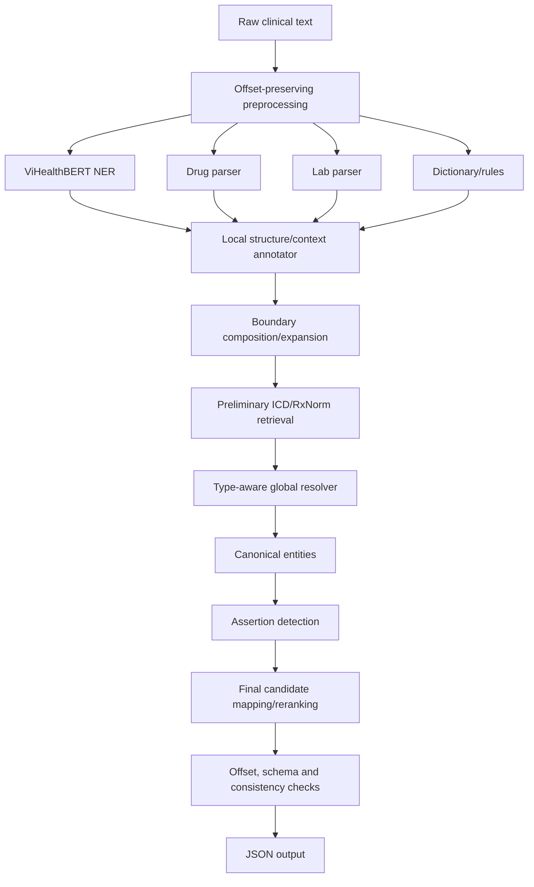

Dựa trên nội dung bạn cung cấp, vấn đề lớn nhất khiến văn bản khó đọc là **sơ đồ pipeline đang được vẽ bằng các ký tự (ASCII art) bị xô lệch**, cùng với **các bảng dữ liệu chưa được định dạng chuẩn Markdown**.

Tôi đã giúp bạn:

1. **Chuyển đổi sơ đồ chữ thành biểu đồ `mermaid**` chuyên nghiệp, trực quan và không bị lỗi cú pháp.
2. **Định dạng lại tất cả các danh sách thành bảng Markdown chuẩn** để dễ theo dõi.
3. **Làm nổi bật (bold)** các key metrics, status (✅, ⚠️, ❌) và các tiêu đề mục.

Dưới đây là bản đã được "sửa lỗi" và trình bày lại hoàn chỉnh:

---

Dựa trên chỉ các tài liệu `.md` trong `plans/active``, pipeline tổng thể của bạn hiện đã đi được khoảng:

* **Raw text**
* ✅ **Offset-preserving preprocessing**
* ✅ **Candidate generators nền tảng:**
* ✅ ViHealthBERT NER inference layer
* ✅ Drug parser
* ✅ Lab parser
* ✅ Dictionary/Rules

* ✅ **Baseline type-aware merge/resolver**
* ⚠️ **Linking** mới có một phần / chưa thành full pipeline
* ❌ **Assertion detection** chưa thấy implemented
* ❌ **Final ICD/RxNorm reranking + output end-to-end** chưa hoàn chỉnh
* ❌ **Training/fine-tuning/dev tuning** chưa hoàn chỉnh

Nếu quy đổi theo roadmap trong `active/00_overview/00_architecture_hybrid_vihealthbert.md`, bạn đã hoàn thành khá chắc phần hạ tầng extraction + resolver baseline, nhưng chưa hoàn thành phần training, assertion, linking end-to-end, output/evaluation tuning.

---

## 1. Bảng trạng thái theo pipeline tổng thể

**Pipeline kiến trúc trong `active/00_overview/00_architecture_hybrid_vihealthbert.md` là:**

**Trạng thái hiện tại theo `.md`:**

| Tầng | Trạng thái | Nhận xét |
| --- | --- | --- |
| **Raw-text / offset contract** | ✅ Đã làm | Có preprocessing offset-safe, half-open `[start, end)`, invariant `raw_text[start:end] == text`. |
| **Offset-preserving preprocessing** | ✅ Đã triển khai | Có normalized view, raw map, line/sentence/model windows, token offsets. |
| **ViHealthBERT NER layer** | ⚠️ Inference có, training chưa | Có BIO/BIOES decoding, offset mapping, threshold theo type, tests pass. Nhưng chưa có dataset builder, fine-tuning script, checkpoint. |
| **Drug parser** | ✅ Baseline tốt | Có seed từ dictionary/RxNorm/NER, boundary composition, dose/route/frequency/PRN, trace, RxNorm prelink optional. |
| **Drug alias expansion** | ✅ Đã làm mạnh | `drug_aliases.csv` từ 28 lên khoảng 9.400 alias RxNorm. |
| **Lab parser v1** | ✅ Đã làm | Có seed từ dictionary/NER, name-result pairing, numeric/range/qualitative result, parenthetical expansion, trace. |
| **Lab parser v2 / metadata** | ✅ Đã cập nhật | Dùng `LabTermEntry`, `lab_terms_curated.csv`, canonical metadata, context gate alias mơ hồ, 38/38 tests pass. |
| **Dictionary/Rules** | ✅ Đã cập nhật | Trở thành candidate/evidence provider (không còn precedence cứng). Có `rule_id`, `reliability_tier`. |
| **Structural fallback** | ✅ Có (hạ quyền lực) | Confidence thấp, guardrails, resolver loại nếu có parser/NER tốt hơn. |
| **Type-aware resolver / merge** | ✅ Baseline đã làm | `src/merge.py`: source-aware rank, reliability tier, merge duplicate, parser thắng fallback, 12/12 tests pass. |
| **Local structure/context** | ⚠️ Có một phần | Drug/lab parser và rule có local role/context evidence. Chưa thấy annotator tổng quát độc lập. |
| **Preliminary ICD/RxNorm retrieval** | ⚠️ Một phần | Drug parser có optional RxNorm prelink. Chưa thấy ICD cho diagnosis hoặc preliminary feature cho global resolver. |
| **Canonical entities** | ⚠️ Một phần | Có candidate merged, nhưng chưa thấy end-to-end canonical entity layer hoàn chỉnh đi kèm assertion/linking. |
| **Assertion detection** | ❌ Chưa implemented | Thiết kế hybrid cue rules + classifier có trong docs nhưng chưa có log triển khai. |
| **Final ICD/RxNorm mapping** | ❌ Chưa hoàn chỉnh | Có resource/linker evidence một phần, chưa thấy full 2-stage retrieval + reranking end-to-end. |
| **Output writer + validation** | ⚠️ Một phần | Preprocessing có validation tốt; nhưng chưa thấy output JSON end-to-end hoàn chỉnh. |
| **Official evaluation / ablation** | ❌ Chưa hoàn chỉnh | Yêu cầu official scorer, ablation A-G, oracle experiments; chưa thấy log đã chạy. |

---

## 2. Những phần đã đạt khá chắc

### 2.1 Offset-preserving preprocessing — ✅ Đã đạt

Đã có: `raw_text`, `normalized_lookup_text`, `norm_to_raw_map`, `raw_to_norm_map`, `line_windows`, `sentence_windows`, `model_windows`, `token_offsets`.
**Contract quan trọng:** `raw_text[start:end] == span.text` đã được đảm bảo. Tầng nền đã ổn.

### 2.2 ViHealthBERT NER inference layer — ⚠️ Đã có layer, chưa có model

Đã có: BIO/BIOES decoding, offset mapping, dedup overlapping windows, threshold theo type.
**Giới hạn:** Chưa gồm dataset builder, fine-tuning script, checkpoint trong repo, confidence chưa calibrated, chưa composition boundary cho thuốc/xét nghiệm.

### 2.3 Drug parser — ✅ Đã đạt baseline mạnh

Đã có: `DrugCoreSeed`, `DrugComponents`, `DrugParseTrace`, boundary composition, local medication role, optional RxNorm prelink.
**RxNorm alias expansion:** `drug_aliases.csv` tăng từ 28 → ~9.400, ứng viên tăng mạnh, 69 tests PASS.
**Giới hạn:** Confidence heuristic, chưa tự chạy HF backend, chưa tích hợp script V0.

### 2.4 Lab parser — ✅ Đã đạt baseline và đã nâng cấp v2

Đã có (v2): `LabTermEntry` từ `lab_terms_curated.csv`, canonical_key, context gate cho alias mơ hồ (K, Ca, Na...), overlap resolution (bilirubin toàn phần > bilirubin), expanded units, canonical metadata. 38/38 tests pass. Đây là một trong các phần tiến xa nhất.

### 2.5 Dictionary/Rules — ✅ Đã chuyển đúng vai trò

Đã chuyển sang: **candidate/evidence provider**. Có `rule_id`, `reliability_tier`, trace JSON. Các test (rule extractor, merge, drug, lab) đều pass. Đã chỉnh đúng kiến trúc hybrid.

### 2.6 Type-aware merge/resolver — ✅ Baseline đã có

Đã viết lại `src/merge.py` với: `SOURCE_RELIABILITY_RANK`, `RELIABILITY_TIER_RANK`.
Behavior đã xử lý tốt:

| Scenario | Result |
| --- | --- |
| NER + Dict exact match | Merge sources |
| NER span dài > Dict span ngắn | NER thắng dictionary |
| Rule drug vs Drug parser exact | Merge, parser trace survive |
| Rule lab vs Lab parser exact | Merge, lab_parser survive |
| Structural fallback vs parser | Fallback bị loại |

---

## 3. Những phần mới đạt một phần

### 3.1 Local structure/context annotator

Đạt một phần dưới dạng embedded features trong parser/rules. Chưa thấy log cho một local structure/context annotator độc lập (như check `is_heading_like`, `has_negation_cue`, v.v.).

### 3.2 Preliminary ICD/RxNorm retrieval

Mới đạt RxNorm/drug prelink. Chưa thấy tích hợp ICD preliminary evidence cho diagnosis vào resolver hoặc final reranking.

### 3.3 Canonical entities / output validation

Đã có merged candidates, nhưng chưa nối thành final submission pipeline đầy đủ (từ assertion → final linking → JSON output).

---

## 4. Những phần chưa thấy hoàn thành (❌)

* **4.1 Dataset builder:** Tài liệu ghi rõ chưa có dataset builder/fine-tuning script (Milestone 1).
* **4.2 ViHealthBERT fine-tuning:** Chưa có checkpoint, backbone comparison, hay dev score calibration.
* **4.3 Assertion detection:** Chưa thấy implementation cho assertion rules (isNegated, isFamily, isHistorical).
* **4.4 Final ICD/RxNorm reranking:** Chưa thấy full stage 2 reranking, top-k/margin tuning.
* **4.5 End-to-end official evaluation:** Chưa thấy log chạy ablation (A-G) hoặc official scorer end-to-end.

---

## 5. Mapping theo roadmap milestone

| Milestone | Trạng thái hiện tại | Ghi chú |
| --- | --- | --- |
| **M0 — Annotation guideline / dev set** | ❓ Chưa thấy | Không thấy `.md` xác nhận dev set sạch. |
| **M1 — Dataset builder** | ❌ Chưa | Ghi nhận chưa có script. |
| **M2 — ViHealthBERT baseline** | ⚠️ Một phần | Có inference layer, chưa có checkpoint/dev score. |
| **M3 — Structured parsers** | ✅ Phần lớn đạt | Drug/Lab parser đã có tests và trace mạnh. |
| **M4 — Type-aware resolver** | ✅ Baseline đạt | Source-aware resolver pass tests, nhưng chưa calibrated. |
| **M5 — Linker feedback** | ⚠️ Một phần | Có RxNorm drug prelink, nhưng chưa full ICD/RxNorm feedback. |
| **M6 — Assertion hybrid** | ❌ Chưa | Chưa thấy implementation log. |
| **M7 — End-to-end tuning** | ❌ Chưa | Chưa thấy official final score/ablation. |

---

## 6. Kết luận ngắn gọn

Bạn hiện **ĐÃ ĐẠT** tới mức:
✅ Hạ tầng offset-safe
✅ Candidate generation cho 5 entity types
✅ Drug & Lab parser tương đối mạnh (đã có metadata/context-gate)
✅ Dictionary/Rules đã đóng đúng vai trò
✅ Baseline resolver/merge đã có

Bạn **CHƯA ĐẠT** tới mức:
❌ End-to-end clinical IE system hoàn chỉnh
❌ ViHealthBERT fine-tuned baseline
❌ Assertion detection & Final reranking
❌ Official evaluation/ablation/tuning

**Tóm tắt tiến độ:**

| Khối công việc | Tiến độ |
| --- | --- |
| Extraction infrastructure | **Cao (~70–80%)** |
| Candidate resolution baseline | **Khá cao** |
| End-to-end scoring/submission pipeline | **Còn thấp/trung bình (~45–55%)** |

**Lý do end-to-end thấp hơn:** Metric cuối phụ thuộc mạnh vào `assertions_score` và `final_score` (linking), mà 2 module này hiện chưa được hoàn chỉnh theo tài liệu `.md`.