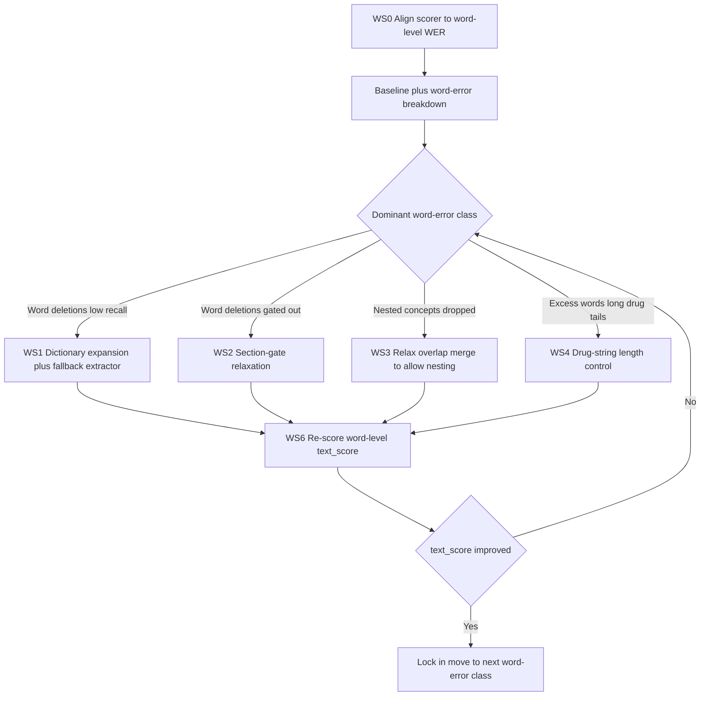

# Proposal: Improving WER (text_score) for ViClinicalIE

> **Status (WS0 done):** Scorer fixed to true word-level WER. Current silver baseline (20 files): **text_score = 0.117**, assertions = 0.156, candidates = 0.040, **final = 0.098**. Span recall is 0.12 — recall is the bottleneck. Concrete, evidence-based improvement areas are in [§5.2](#52-concrete-error-patterns-observed-on-the-silver-set) and [§5.3](#53-prioritized-areas-to-improve-text_score).

## 1. Objective

Raise the `text_score` component of the official metric defined in [`ViClinicalIE/ABOUT.md`](../ViClinicalIE/ABOUT.md:224) section 6:

```
final_score = 0.3 * text_score
            + 0.3 * assertions_score
            + 0.4 * candidates_score
```

`text_score` is worth 30% of the final score directly. It also gates the 40% `candidates_score` indirectly: a concept that is never extracted (or extracted with the wrong text/type) can never be mapped to ICD-10/RxNorm, so recall improvements here compound into candidate scoring.

## 2. How text_score is computed (and how the local scorer used to get it wrong)

> This section documents the **original (pre-WS0)** concept-level behavior for context. The scorer has since been fixed to true word-level WER — see [§2.1](#21-confirmed-metric-definition-word-level-wer-on-the-text-field) and [§5.1](#51-corrected-word-level-baseline-ws0-done).

Contrary to the name, the *original* scorer did not measure word-level WER. In [`scripts/score_silver.py`](../ViClinicalIE/scripts/score_silver.py:270) each file was turned into a **sequence of concept tokens**, where each token is produced by [`_concept_id()`](../ViClinicalIE/scripts/score_silver.py:252):

```python
concept_id = (type, " ".join(text.split()))   # whitespace-normalized text + type
```

Then Levenshtein edit distance is taken between the gold concept sequence and the predicted concept sequence:

```
text_score(file) = max(0, 1 - edit_distance(gold_concepts, pred_concepts) / len(gold_concepts))
text_score       = mean over all files
```

### Consequences that drive the score

A concept scores only if **both `type` AND whitespace-normalized `text` exactly match** a gold concept. Four error classes each cost one edit operation:

| Error class | Edit type | Example |
|---|---|---|
| Missing concept (recall gap) | deletion | gold has `"ợ hơi"`, we emit nothing |
| Extra concept (false positive) | insertion | we emit a term the gold does not have |
| Boundary mismatch | substitution | gold `"ngất xỉu"` vs our `"ngất xỉu trong xe"` |
| Wrong type on correct text | substitution (double-penalized) | we say `CHẨN_ĐOÁN`, gold says `TRIỆU_CHỨNG` |

Important detail: the scorer only normalizes **whitespace**. Casing and diacritics are preserved, so `"Ho"` vs `"ho"` is a mismatch. Position/offset does **not** enter text_score at all — only `(type, text)` matters for this metric.

Per the [`ABOUT.md`](../ViClinicalIE/ABOUT.md:248) note, a correct text with the wrong type is counted as a brand-new concept, so it is penalized on both sides (our wrong-type concept is an insertion, the gold concept is a deletion).

### 2.1 Confirmed metric definition: word-level WER on the text field

The official metric has two parts. The outer aggregation shared by the organizers is:

```
text_score = sum_over_test( 1 - WER(i) ) / len(test)
```

The inner `WER(i)` is confirmed by the organizers as:

> "WER(i) là WER của trường text trong sample i" — WER(i) is the WER of the `text` field in sample i.

So `WER(i)` is **standard word-level Word Error Rate computed over the `text` field**, not a concept-atomic edit distance. This is a critical correction: the current local scorer [`_wer_score()`](../ViClinicalIE/scripts/score_silver.py:270) treats each whole entity `(type, text)` as one indivisible token, which is the **wrong granularity** and will report misleading numbers.

| Property | Concept-level (current local scorer — WRONG) | Word-level (official — CORRECT) |
|---|---|---|
| Token unit | one whole entity `(type, text)` | one word |
| A 1-word boundary slip | zeroes the entire concept (full edit) | costs only 1 word out of the sample's word count |
| Denominator | number of gold concepts | number of gold words in the text field |
| Long multi-word drug strings | weigh the same as a 1-word symptom | dominate the denominator (many words) |

Implications for optimization, in order of leverage under the confirmed definition:

1. **Recall (missing words) dominates.** Every word of a missed concept is a deletion. Missing a long drug string like `"amlodipine 10 mg po daily"` costs 5 word-deletions. Recall lift is the single highest-value workstream.
2. **Boundary micro-errors are cheap, not fatal.** Getting `"ngất xỉu"` when gold is `"cơn ngất xỉu"` costs 1 word, not a full concept. Aggressive boundary tuning matters much less than under the old proxy — do not over-invest here.
3. **Extra words (false positives) are insertions**, each costing 1 word. Verbose over-extraction is mildly penalized per extra word.
4. **The `type` field does not enter `WER(i)` at all** — it only affects `assertions_score` / `candidates_score` and the ABOUT.md double-count note. So type confusion is *not* a text_score problem; it is re-scoped out of this WER work (still tracked for the other 70% of the score).

Open sub-questions to confirm against the organizer's tokenizer (affects exact numbers, not direction):
- **Assembly order**: how are per-entity `text` values concatenated into "the text field" before tokenizing — submission order, position order, or a canonical sort? Word-level WER is order-sensitive, so this must match.
- **Tokenization**: whitespace split vs a Vietnamese word segmenter; whether casing and diacritics are normalized; how punctuation and numbers/units are tokenized.

Action: **rewrite the local scorer to compute true word-level `WER(i)` over the assembled text field** (Workstream 0), replacing the concept-atomic proxy, and align tokenization/order with the organizer's checker as closely as known. All baseline and delta numbers in later workstreams must come from this corrected scorer.

## 3. Current pipeline (baseline)

The system is fully rule/dictionary-based and deterministic (see [`report_pipeline_overview.md`](../ViClinicalIE/report_pipeline_overview.md:1)):

```
raw *.txt
  -> parse_documents (normalize + section detection + line typing)
  -> rule extractors (lab / drug / diagnosis / symptom + non-target reject)
  -> assertions
  -> merge_candidates (overlap resolution: one entity per char range)
  -> link ICD10 / RxNorm candidates
  -> write JSON + zip
```

## 4. Root causes of text_score loss

### 4.1 Recall ceiling from dictionaries (deletions)
Every extractor fires only on terms present in `data_resources/*_seed_terms.csv`:
- [`extract_symptom_candidates()`](../ViClinicalIE/src/rule_extractors.py:410)
- [`extract_diagnosis_candidates()`](../ViClinicalIE/src/rule_extractors.py:353)
- [`extract_drug_candidates()`](../ViClinicalIE/src/rule_extractors.py:291)

Any concept not in the dictionary is a guaranteed deletion. The span-extraction report lists dictionary coverage as limitation #1 ([`report_span_extraction.md`](../ViClinicalIE/report_span_extraction.md:278)).

### 4.2 Section gating drops valid concepts (deletions)
- Symptoms are rejected unless the line is in `SYMPTOM_SUBSECTIONS` or the section is `CURRENT_HISTORY` ([`rule_extractors.py:418`](../ViClinicalIE/src/rule_extractors.py:418)).
- Diagnoses require `strong_context` or a bullet/key-value line ([`rule_extractors.py:379`](../ViClinicalIE/src/rule_extractors.py:379)).

When section detection misclassifies a line — likely given the noisy, inconsistent headers documented in [`Data_assessment.md`](../ViClinicalIE/Data_assessment.md:25) — a correct concept is silently dropped.

### 4.3 Overlap merge deletes nested gold concepts (deletions)
[`merge_candidates()`](../ViClinicalIE/src/merge.py:45) enforces at most one entity per character range via [`_overlaps()`](../ViClinicalIE/src/merge.py:40). But the silver gold contains legitimately nested concepts. Example from [`silver_test/output/3.json`](../ViClinicalIE/silver_test/output/3.json:3):

```json
{ "text": "cơn ngất xỉu", "position": [63, 75], "type": "TRIỆU_CHỨNG" }
{ "text": "ngất xỉu",     "position": [67, 75], "type": "TRIỆU_CHỨNG" }
```

The current merge keeps only one of these, forcing a deletion error on the other.

### 4.4 Boundary divergence from gold conventions (word substitutions)
- [`extend_drug_span()`](../ViClinicalIE/src/rule_extractors.py:222) greedily appends dose/route/frequency.
- [`expand_symptom_span()`](../ViClinicalIE/src/rule_extractors.py:396) appends anatomical/timing qualifiers.

Under the confirmed **word-level** `WER(i)`, a boundary slip no longer zeroes the whole concept — it costs only the differing words (e.g. our `"ngất xỉu trong xe"` vs gold `"ngất xỉu"` costs 2 inserted words, not a full concept). This is a much softer penalty than under the current concept-level proxy, so boundary micro-tuning drops in priority. The exception is greedy drug-string expansion: long dose/route/frequency tails add many words, so an over-long drug span can still inject several word errors.

### 4.5 Type confusion (impact depends on assembly)
The `CHẨN_ĐOÁN` vs `TRIỆU_CHỨNG` distinction is genuinely ambiguous in this data ([`Data_assessment.md`](../ViClinicalIE/Data_assessment.md:28)). Because the official `WER(i)` is computed on the **`text` field**, type errors do not directly change the word sequence when the text is right — their cost enters via `assertions_score`/`candidates_score` and via the ABOUT.md §248 double-count rule, not via `WER(i)` itself. This lowers type disambiguation's priority for the WER metric specifically (it remains important for the other 70% of the score).

## 5. Important caveat: assembly detail + no measured baseline yet

The organizers confirmed `WER(i)` is the **word-level WER of the `text` field** for sample `i`. One assembly detail still needs to be verified against the official checker before locking the scorer: how the per-concept `text` fields are concatenated into the sample word sequence (order of concepts, whether type/position influences alignment, and whether text is lowercased / diacritics stripped before tokenizing). The working assumption is: concatenate concept `text` values in a deterministic order into one word sequence, then standard word-level Levenshtein. Workstream 0 encodes this and reports it so it can be corrected if the checker differs.

### 5.1 Corrected word-level baseline (WS0 done)

The scorer in [`_wer_score()`](../ViClinicalIE/scripts/score_silver.py:295) has been switched to true word-level WER over the assembled `text` field (see [`_text_words()`](../ViClinicalIE/scripts/score_silver.py:258)). The pipeline was rebuilt with [`build_v0_linked_outputs.py`](../ViClinicalIE/scripts/build_v0_linked_outputs.py:1) and scored against the 20-file silver gold in [`silver_test/output/`](../ViClinicalIE/silver_test/output/1.json):

| Metric | Value |
|---|---:|
| text_score (word-level WER) | 0.1169 |
| assertions_score | 0.1556 |
| candidates_score | 0.0402 |
| **final_score** | **0.0978** |

Diagnostic exact-match span detection (span_type): P=0.20, R=0.12, F1=0.15 (TP=46, FP=182, FN=324).

Per-type F1 / recall:

| Type | P | R | F1 | TP | FP | FN |
|---|---:|---:|---:|---:|---:|---:|
| CHẨN_ĐOÁN | 0.28 | 0.14 | 0.19 | 11 | 28 | 65 |
| THUỐC | 0.29 | 0.16 | 0.21 | 5 | 12 | 26 |
| TRIỆU_CHỨNG | 0.19 | 0.17 | 0.18 | 29 | 122 | 144 |
| TÊN_XÉT_NGHIỆM | 0.00 | 0.00 | 0.00 | 0 | 11 | 41 |
| KẾT_QUẢ_XÉT_NGHIỆM | 0.10 | 0.02 | 0.03 | 1 | 9 | 48 |

Reading of the baseline:
- **Recall is the dominant failure** (FN=324 vs FP=182, overall R=0.12). This confirms WS1–WS3 are the priority.
- **Lab extraction is near-zero** — `TÊN_XÉT_NGHIỆM` R=0.00 and `KẾT_QUẢ_XÉT_NGHIỆM` R=0.02. The lab name/value regex path ([`extract_lab_candidates()`](../ViClinicalIE/src/rule_extractors.py:237)) is effectively not firing on this data. This is the single biggest recall hole and is added as a focused sub-task of WS1.
- **Simultaneous FP+FN in the same type** (e.g. TRIỆU_CHỨNG FP=122, FN=144) points partly at boundary/nesting mismatches, not just misses — WS3/WS4 will recover some of these.
- Numbers are on 20 silver files only; treat as directional (see gold-trust caveat below).

**Step 1 (WS0) is complete.** The prioritization below is the expected ordering; it is now confirmed by the actual error distribution (recall-first).

A second caveat: the silver gold in [`silver_test/output/`](../ViClinicalIE/silver_test/output/1.json) was generated by `gpt-4o-mini` (see [`silver_manifest.json`](../ViClinicalIE/silver_test/silver_manifest.json:1)), so it is an imperfect proxy for the real private test. Optimizing hard against noisy gold risks overfitting to LLM quirks. A short quality spot-check is warranted before trusting boundary-level targets.

### 5.2 Concrete error patterns observed on the silver set

Pulled from [`reports/silver_eval.md`](../ViClinicalIE/reports/silver_eval.md:63) top FP/FN lists. Each pattern maps to a fixable cause.

**A. Files where the pipeline extracts almost nothing (largest word-deletion source).**
Per-file span TP/FP/FN shows several near-empty predictions: file 2 (pred=1, gold=8), file 6 (pred=0, gold=6), file 7 (pred=3, gold=22), file 9 (pred=1, gold=13), file 13 (pred=6, gold=37), file 15 (pred=0, gold=4), file 17 (pred=12, gold=32), file 20 (pred=11, gold=27). These are whole-document recall collapses — most likely section detection failing so the section gates (§4.2) suppress everything. Highest-value single fix.

**B. Gold spans are longer/clausal; we emit the short head (boundary + recall).**
Gold frequently keeps a whole descriptive clause as one `TRIỆU_CHỨNG`, while we emit only the seed word or miss it:
- gold `"cảm giác thắt chặt ngực vùng trước tim"` — we have short/partial variants.
- gold `"Cảm thấy mệt mỏi nhiều khi gắng sức trong tuần qua"` — missed.
- gold `"đau lưng kéo dài"`, `"buồn nôn thoáng qua"`, `"ho mạn tính có đờm vàng loãng"` — missed.
Under word-level WER these long gold spans are worth many words each, so missing them is expensive. Note some gold spans even include the key label and colon (e.g. `"đánh trống ngực:  còn cảm giác..."`), which is a gold-quality quirk to weigh, not blindly chase.

**C. Drug spans: gold includes indication/parenthetical, we stop at dose.**
- gold `"doxycycline cho viêm tuyến mồ hôi"` vs our `"doxycycline"`.
- gold `"atenolol (uống hôm nay)"` vs our `"atenolol"`.
So for drugs the gold boundary is *longer* than ours, the opposite of the over-extension worry in §4.4. WS4 must be data-driven, not assume trimming.

**D. Lab names/results almost entirely missed (§5.1).**
- gold `"chụp cắt lớp vi tính mạch máu (ctma)"` typed `TÊN_XÉT_NGHIỆM` — we currently treat imaging as non-target and reject it.
- gold `"Nhịp xoang chiếm ưu thế"` typed `KẾT_QUẢ_XÉT_NGHIỆM` — qualitative result our VALUE_PATTERN does not catch.
The lab extractor requires a name→value adjacency ([`extract_lab_candidates()`](../ViClinicalIE/src/rule_extractors.py:237)); many gold labs are name-only or qualitative, so nothing fires.

**E. Duplicate/insertion false positives.**
We emit repeated `"đánh trống ngực"`, `"khó thở"` many times in file 1 (FP), while gold captures each once as part of a longer clause. This is both a boundary problem (B) and a de-dup/merge problem — repeated short spans inflate insertions.

**F. Negation-context spans.**
gold `"Không  buồn nôn, hay nôn, đổ mồ hôi"` is one negated `TRIỆU_CHỨNG` span in gold; we split/miss it. Relevant to both WER (word coverage) and assertions.

### 5.3 Prioritized areas to improve text_score (reduce WER)

Ordered by expected word-level WER gain. Each cites the pattern (A–F) it addresses.

1. **Fix whole-document recall collapses (pattern A).** Diagnose why files 2/6/7/9/13/15/17/20 extract almost nothing — almost certainly section detection failing, cascading through the section gates. Fix section detection and/or add an ungated fallback pass. Biggest single lever because these files contribute the most deletions.
2. **Repair lab extraction (pattern D, §5.1).** Allow name-only `TÊN_XÉT_NGHIỆM` (drop the mandatory adjacent value), extend `VALUE_PATTERN` to qualitative results, and stop rejecting imaging study names that gold types as tests. Recovers two types that are currently ~0.
3. **Relax section gates for symptoms/diagnoses (pattern A/B, WS2).** Permit extraction outside the strict `SYMPTOM_SUBSECTIONS`/`CURRENT_HISTORY` gates with a confidence penalty, so misclassified sections stop causing silent deletions.
4. **Data-driven span boundaries (patterns B, C, WS4).** Learn the gold convention: symptoms and drugs often extend to a clause/indication. Grow spans to clause boundaries for symptoms and include drug indication/parenthetical, rather than trimming. This is now a *recall/boundary* task, not a trimming task.
5. **Dictionary + fallback recall lift (WS1).** Expand `data_resources/*_seed_terms.csv` from the FN list and add a dictionary-independent candidate generator (gazetteer from ICD/RxNorm surface forms, or a self-hosted ≤9B NER), with offset validation as the gate. Catches out-of-dictionary concepts across all types.
6. **Nesting + de-dup policy (patterns E, §4.3, WS3).** Preserve legitimate nested gold spans while collapsing spurious repeated short spans that inflate insertions.
7. **Negation-scope spans (pattern F).** Keep enumerated negated symptom lists as the gold-shaped span; helps WER word coverage and assertions together.

Type disambiguation (WS5) remains out of scope for WER (does not change the word sequence) but is tracked for the assertions/candidates score.

## 6. Proposed workstreams (priority order)



### Workstream 0 — Scorer alignment + baseline and error attribution
Two sub-steps, in order:

1. **Scorer alignment (§2.1, §5).** Replace/augment the concept-level [`_wer_score()`](../ViClinicalIE/scripts/score_silver.py:270) with the confirmed **word-level** `WER(i)` on the `text` field: tokenize each concept's `text` into words, assemble the per-sample word sequence deterministically, and take standard word-level Levenshtein. Keep the old concept-level number as a secondary diagnostic. Document the assembly assumptions so they can be corrected against the official checker.
2. **Baseline and error attribution.** Run the aligned scorer, capture word-level `text_score` and the top false positives/false negatives by type from the existing report emitters in [`score_silver.py`](../ViClinicalIE/scripts/score_silver.py:568). Deliverable: a table of word-level edit-error counts (insertions/deletions/substitutions) attributed to the root causes.

### Workstream 1 — Recall lift (expected largest gain)
- Expand `data_resources/*_seed_terms.csv` from the false-negative list.
- Add a dictionary-independent fallback extractor for out-of-dictionary concepts (candidate approaches: gazetteer built from ICD-10/RxNorm surface forms already in `data_resources/`, or an optional self-hosted Vietnamese NER model <=9B params per [`ABOUT.md`](../ViClinicalIE/ABOUT.md:250) resource rules), keeping rule-based offset validation as a mandatory gate.

### Workstream 2 — Section-gate relaxation
Loosen or add fallbacks to the section gates in [`extract_symptom_candidates()`](../ViClinicalIE/src/rule_extractors.py:410) and [`extract_diagnosis_candidates()`](../ViClinicalIE/src/rule_extractors.py:353) so misclassified sections do not cause silent word deletions. Balance against false-positive cost (word insertions).

### Workstream 3 — Overlap/nesting policy
Revisit [`merge_candidates()`](../ViClinicalIE/src/merge.py:45) so legitimate nested concepts (§4.3) are preserved. Decide the policy against gold statistics: how often does gold contain nested spans, and of what types.

### Workstream 4 — Drug-string length control (was boundary alignment)
Under word-level WER, boundary micro-tuning matters less **except** where a span adds many words. Focus [`extend_drug_span()`](../ViClinicalIE/src/rule_extractors.py:222) so it does not append long dose/route/frequency tails beyond what the gold convention includes; over-long drug strings are the main word-substitution source. [`expand_symptom_span()`](../ViClinicalIE/src/rule_extractors.py:396) is lower priority (short qualifiers = few words). Add regression tests for the agreed convention.

### Workstream 5 — Type disambiguation (WER-secondary)
`CHẨN_ĐOÁN` vs `TRIỆU_CHỨNG` confusion (§4.5) barely affects word-level `WER(i)` when the text is right, but it drives `assertions_score` and `candidates_score`. Defer for the WER goal; revisit under the full-score pass.

### Workstream 6 — Re-score and iterate
After each workstream, re-run the aligned scorer and compare word-level `text_score` delta. Lock in gains, revert regressions.

## 7. Reprioritization under confirmed word-level WER

With `WER(i)` confirmed as word-level over the `text` field, the ordering that maximizes `text_score` is:

1. **Recall lift (WS1)** — every missed concept is a run of word deletions; largest lever.
2. **Section-gate relaxation (WS2)** — recovers silently dropped concepts (also deletions).
3. **Overlap/nesting policy (WS3)** — recovers dropped nested concepts.
4. **Drug-string length control (WS4)** — the one boundary case that still injects many words.
5. **Type disambiguation (WS5)** — WER-secondary; deferred to the full-score pass.

Recall-oriented work (WS1–WS3) dominates because word-level WER rewards getting the right words on the page far more than getting every span edge exact.

## 8. Open decisions

1. **Pure rules vs hybrid.** Keep the system pure rule/dictionary, or add a self-hosted Vietnamese NER model (<=9B) as a recall booster with rule-based offset/boundary validation retained as the gate?
2. **Gold trust level.** Optimize against the current silver gold as-is, or spot-check its quality first to avoid overfitting to `gpt-4o-mini` artifacts?
3. **Scope of this pass.** WER only, or allow changes that also help `candidates_score` (recall improvements naturally do both)?

## 9. Success criteria

- Measured increase in `text_score` on the silver set, reported per workstream.
- No net regression in `assertions_score` or `candidates_score`.
- All existing tests in [`ViClinicalIE/tests/`](../ViClinicalIE/tests/) still pass, with new regression tests for boundary and nesting conventions.
